# loom architecture — a deep dive

> A document for deeply understanding the system: what is built, how, and **why this way**.
> Every section ends with a "why" — the reasoning is the part worth internalizing.
> Diagrams are Mermaid (they render on GitHub).

---

## 0. One sentence and three ideas

**loom is a replay-deterministic finite-state machine (FSM) for orchestrating multi-step LLM-agent
work**, where safety is not promised by a prompt but **enforced structurally**, and every run is a
reproducible audit trail.

Three load-bearing ideas that set loom apart from ordinary "prompt orchestration":

1. **Determinism via a single time token.** The clock is read exactly once per FSM "tick" and
   threaded through every computation → a run is reproducible bit-for-bit and can be *replayed*.
2. **Safety at commit time.** Invariants — pure functions over state — run *inside* the database
   transaction and roll it back on violation. An agent structurally cannot, say, rewrite the tests
   it is judged by and approve itself.
3. **Kernel domain-blindness.** The kernel knows nothing about "code review", vendors, or transport.
   The domain, the LLM backend, and the "wire" are three independent axes plugged into the kernel.
   A new domain = new data; the kernel does not change.

---

## 1. Why an FSM, not "an agent with tools"

An ordinary "agent" is a model ↔ tools loop inside a black box: non-deterministic, no durability,
no provable guarantees, no point where a human is required to step in. For one-shot tasks that is
enough. For **multi-step work where being wrong is expensive** (code in prod, finance, legal,
regulated processes) it is not.

loom moves "orchestration" out of the prompt and into an **explicit finite-state machine** whose:

- state lives in an **atomic database** (not in the model's context),
- transitions are **reproducible** (not "however the model felt"),
- there are **invariants** (structural prohibitions) and **gates** (human/policy decision points),
- every step **survives a crash** and resumes from the same place with no double work.

The analogy: **"Temporal / a durable workflow engine, but for LLM agents"**, with human-in-the-loop,
structured review, and provable safety as first-class primitives.

---

## 2. Top-down: three axes and the kernel

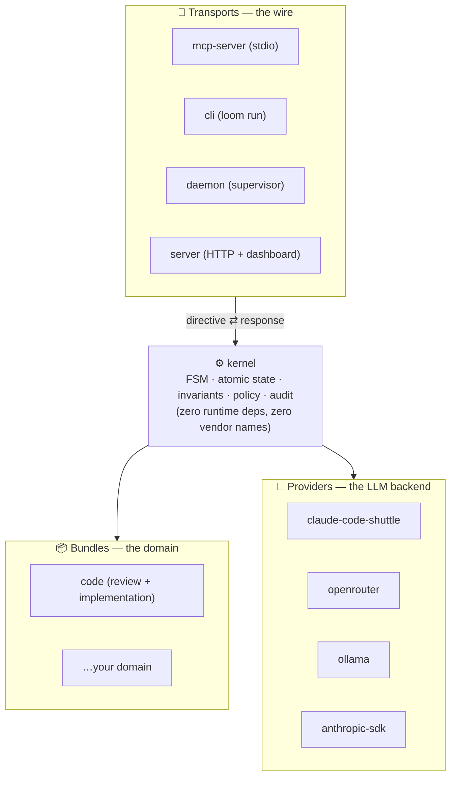

**Any combination (bundle × provider × transport) is valid at the kernel boundary.** That is
"pluggable by design": three orthogonal axes, with the kernel as the stable contract between them.

**Why:** separating the axes keeps the domain from leaking into the kernel. Proven in practice —
over several releases loom added a dashboard, multi-backend dispatch, non-Claude harnesses, and
observability, and **none of it required opening the kernel** (`git diff packages/kernel` is empty).
That is empirical evidence the abstraction is right.

---

## 3. Package map and dependency layers

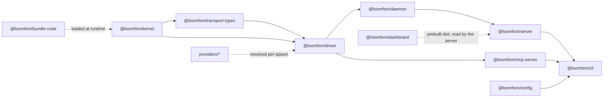

| Package | Role | Key property |
|---|---|---|
| `kernel` | FSM, invariants, ledger, policy, types, state (SQLite) | **zero runtime deps**, zero vendor names (CI grep) |
| `transport-types` | shared directive/response types | breaks the kernel ↔ transport cycle |
| `config` | "configure once": keys, model map, project catalog | single dep is `zod` (outside the kernel) |
| `driver` | transport-neutral `drive()` loop + Executor seam | the directive contract, implemented **once** |
| `daemon` | long-lived supervisor over `drive()` | park/wake, retry, recovery, merge-back |
| `server` | HTTP control plane + project-fleet registry | `node:http` only, zero non-workspace dep |
| `dashboard` | React SPA, served as static assets | published as prebuilt `dist/` |
| `mcp-server` | MCP transport (stdio) + `/task /done /resume` | thin shell over `drive()` |
| `cli` | the `loom` binary | unifies every launch |
| `bundles/code` | the code-review + implementation domain | data: agents + flows + invariants |
| `providers/*` | LLM backends | chosen by **capability**, not by name |

**Layers:** `kernel ← transport-types ← driver ← daemon ← server ← cli`. Each upper layer is one
more consumer of the same `drive()` loop.

**Why:** the kernel is deliberately zero-dep — for safety (minimal attack surface) and for honest
"thin substrate" positioning. All coupling to the world (files, network, processes) is pushed into
the driver/host, so **the kernel stays a pure function over state** — which is exactly what makes
determinism and invariants possible.

---

## 4. The domain model and vocabulary

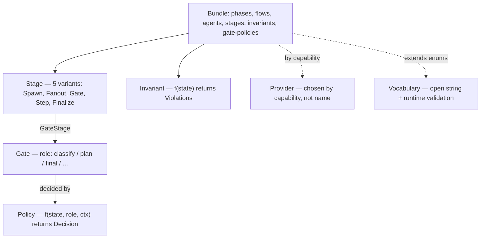

- **Stage** — a flow unit, exactly 5 variants:
  - `SpawnStage` — run one agent;
  - `FanoutStage` — run N agents in parallel (with a concurrency limit / budget);
  - `GateStage` — a checkpoint decided by a policy (often by a human);
  - `StepStage` — a deterministic step marker (e.g. git-diff / test-verify), no model;
  - `FinalizeStage` — the terminal step (the verdict).
- **Flow** — a named sequence of stages. A bundle may have several flows (e.g. a `trivial` flow for
  fast tasks and a heavyweight one for complex tasks).
- **Gate** — a decision point. The gate's **role** (`classify`, `plan`, `final`; bundles add more)
  is what a policy resolves on — **not** the gate's name.
- **Policy** — a function `(state, role, ctx) → Decision`. The kernel does **no switch on policy
  names** — the function *is* the contract. Three stock factories: `human` (approve every step),
  `on-blockers` (ask only on a real blocker — the default), `auto` (full autonomy with a
  deterministic safety floor).
- **Invariant** — a pure function over state, run in-transaction; a violation rolls it back.
  Example from the code bundle: "acceptance cannot pass while a blocking finding is open"; "if an
  agent touched the tests, the final gate must be human-approved".
- **Provider** — the LLM backend, chosen by **capability**, not by name; per-agent/per-phase routing.
- **Vocabulary&lt;T&gt;** — a reusable "open string + runtime validation" primitive for every
  kernel-extensible enum (`audit_types`, `output_kinds`, `decided_by`, `error_classes`,
  `sandbox_kinds`, `provider_features`, `gate_roles`). Adding a value needs no schema migration.
- **NowToken** — a branded ISO-8601 time string (see §6, §10).

**Two state projections, one source:** `PipelineState` is the kernel's full internal state;
`BundleStateView` is the narrow projection bundle code sees (no `driver.*`, no `schema_version`).
A bundle cannot reach for what it has no business knowing.

---

## 5. A task's lifecycle

Phases (declared by a bundle; example — the code bundle):

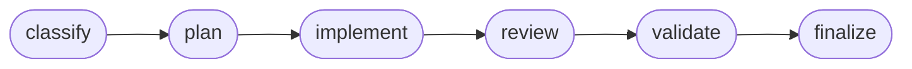

Inside the phases a **flow of stages** runs. One task as a state machine:

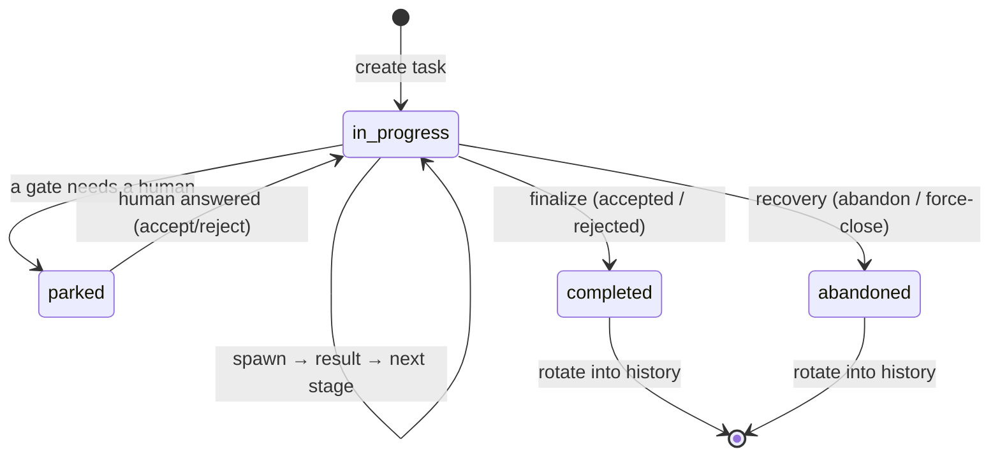

**One task per project, by construction.** The canonical aggregate tables are single-row
(`id = 1` CHECK). Finishing a task is **not clearing a row but rotating the whole store** to
`<project>/.claude/history/<task_id>.db`; the next task creates a fresh store in the freed slot.

**Why:** one-task-per-project radically simplifies the concurrency and recovery model (no
in-project task scheduler, no races for the slot). Parallelism is at the *project* level (see §12),
not over tasks within one project.

---

## 6. One FSM tick — the heart of determinism

A "tick" = one turn of the machine: load state → run the pure FSM function → get a **directive**
(what the transport must do next) → atomically persist the new state.

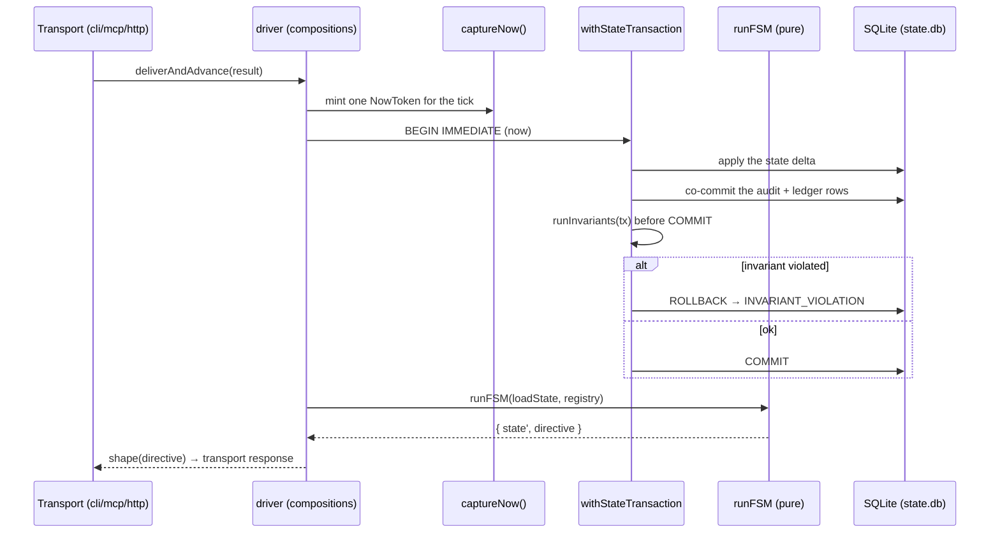

The key: **the clock is read exactly once per tick** (`captureNow()` in the driver) and threaded
as a `NowToken` into every kernel call — invariants, policies, row writes. Inside the kernel it is
**forbidden** to read `Date.now()`/`new Date()` (a load-bearing CI grep; the exceptions are
documented: the id generators and minting the token). So replaying the same
`(state, NowToken, ledger)` reproduces the same trajectory **bit-for-bit**.

**Why (the subtle part):** non-determinism in ordinary agents comes from two sources — the model
itself, and "hidden" time/randomness in the orchestrator. loom moves the model out into the
Executor seam (its answer is an *input*, not part of the machine) and freezes time with a token.
What remains is a pure transition function → reproducibility, and the ability to "replay a run
against a *changed* invariant" to ask "what if".

---

## 7. The orchestration loop (driver)

The driver is the transport-neutral "bookkeeping" that *any* transport must do, implemented
**once**. Three compositions:

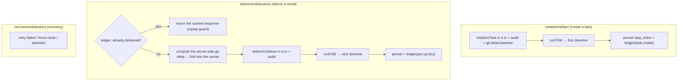

A stage runs through the **Executor seam**:

```
Executor.execute(ProviderShuttleIntent) -> { agent_output, usage? }
```

The `drive()` loop is **blind to the backend** — it calls `execute`, gets text, hands it back to
the kernel. Who runs the spawn, and how, is the injected Executor's job:

| Executor | what it does |
|---|---|
| `createSandboxedExecutor` | run in an isolated copy of the project + self-diff |
| `createContainerExecutor` | the same, but inside Docker (the isolation boundary) |
| `createClaudeCodeExecutor` | `claude -p` on the subscription (no API key) |
| `createAiderExecutor` / `createOpencodeExecutor` | non-Claude agentic CLIs |
| `createDispatchExecutor` | route *each* spawn to its own backend (per-spawn) |
| `createProviderExecutor` | a direct provider call (raw API) |

**Why:** the Executor seam is where "the dirt of the world" is separated from the pure kernel.
Thanks to it the same `drive()` runs `claude -p`, OpenRouter, local Ollama, or Aider — without a
single line in the kernel. The replay-guard in `deliverAndAdvance` (a ledger check before the tick)
is what makes a **re-delivery** (a crash between commit and recording the response) safe for *any*
transport, not only for the ones that "remembered" to check.

---

## 8. Running a spawn: the sandbox, self-diff, merge-back

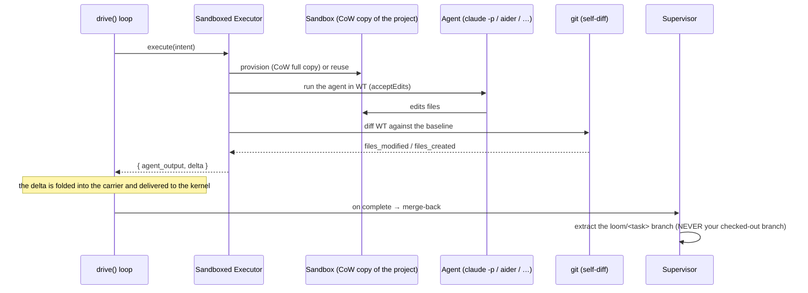

- **The sandbox is a full copy-on-write copy of the project directory** (gitignored files,
  `node_modules`, generated code, `.git`) — not a git checkout. Reason: a git worktree carries only
  *tracked* files → a real project's generated code and dependencies would be absent, and a headless
  agent would trip on "path does not exist". CoW (`cp -c` / `--reflink`) makes the copy instant and
  ~free on disk.
- **Self-diff** of the copy gives an honest `files_modified`/`files_created` — the sole carrier
  source under isolation (the main working tree has no changes).
- **Merge-back** extracts the work to a `loom/<task>` branch, **never** auto-merging into your
  checked-out branch. The container mode mounts the same copy rw — process isolation as the
  blast-radius boundary for a `bypassPermissions` agent.
- **Honest degradation:** a non-git project runs "in place" (no isolation) and you are told; loom
  **never pretends it isolated when it did not**.

---

## 9. State storage

The schema of one task (simplified):

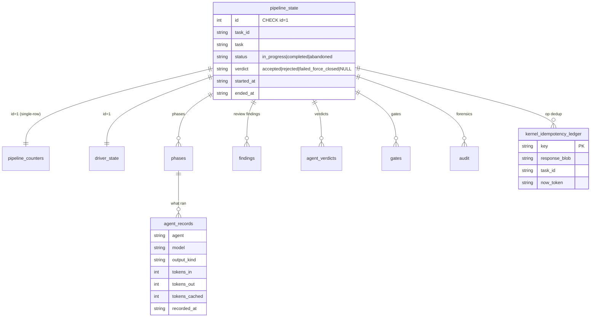

The discipline baked into the schema:

- **`id = 1` CHECK** on aggregates — any second INSERT trips the PK+CHECK → rollback. One task,
  structurally.
- **`json_valid(col)` CHECK** on every JSON column — malformed JSON never reaches disk.
- **status/verdict enums are an IN-list at the SQL layer**; open vocabularies (`output_kind`,
  `decided_by`, `audit.type`) stay plain TEXT + runtime validation against the registered vocabulary
  (adding a value needs no migration).
- **timestamps are TEXT supplied by the caller** (no `datetime('now')`); the SQL layer never reads
  the clock → tx computations are bit-identical on replay.

**Engine and concurrency (the subtle part):**

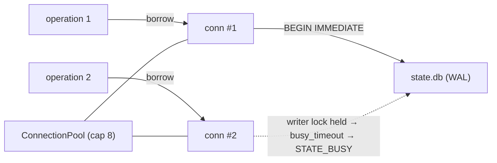

- **WAL mode**: readers never block the writer; a read transaction pins one snapshot for its
  lifetime.
- **Connection pool: one connection per operation.** Two ticks of one project can never re-enter a
  transaction on the same handle → "cannot start a transaction within a transaction" is impossible
  *by construction*. In-process write contention hits the same SQLite writer lock as the
  cross-process case → a typed `STATE_BUSY`.
- **Migrations under `BEGIN IMMEDIATE` with a version re-read *inside* the lock** — two first-opens
  of the same fresh file (another process/connection) serialize: the loser takes the lock, re-reads
  "versions already applied", and no-ops (instead of failing on "table already exists").
- **WAL checkpoint discipline** (after migration + on close) — otherwise a fresh / cross-process
  connection would read the empty main file as "no such table". A raw driver "no such table" is
  mapped to a typed **recoverable** `STORE_SCHEMA_MISSING`, not "the database isn't migrated" (a
  misdiagnosis trap).

**Idempotency ledger — co-commit:** the ledger row is written **inside the same SQLite transaction**
as the effect it dedupes. "Row exists / doesn't" is atomic with the effect. This is the foundation
of crash-safety (see §10).

---

## 10. Determinism and idempotency — the two keystones

### Determinism

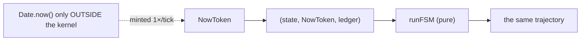

- One time token per tick, threaded everywhere, persisted in the ledger, **replayed verbatim**.
- The audit log records every spawn/finding/verdict/gate → you can open the DB and see what
  happened; you can replay a run against a *changed* invariant and ask "what if".

### Idempotency / crash-safety

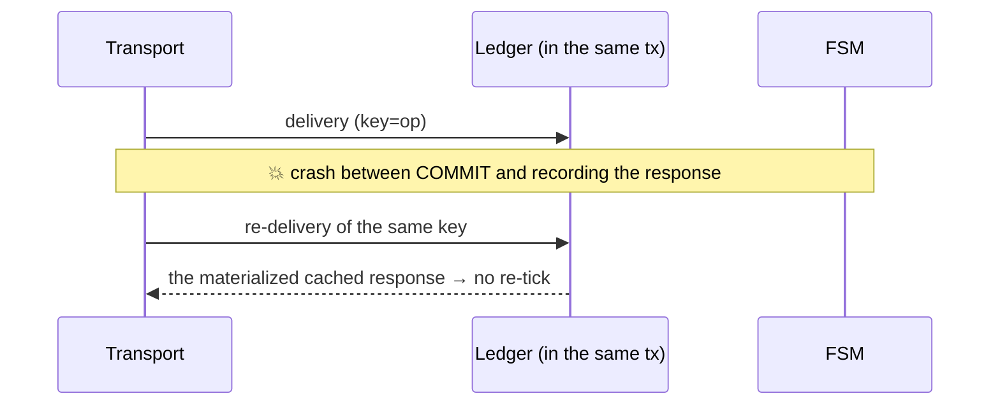

- Recovery = "restart and let the ledger dedup" — no half-applied steps, no reconciliation loop.
- The daemon turns this into a feature: a drop (a slept laptop, a killed process) just pauses it,
  and on start the task **re-drives itself** with the same `agent_run_id`s (idempotent re-delivery,
  no double work).

**Why it matters:** "same input → same result" + "a co-committed ledger" is what turns
the scary "the agent crashed halfway" into a trivial "restart". Most agent frameworks give you
neither and leave you to fix it by hand.

---

## 11. The safety model (in layers)

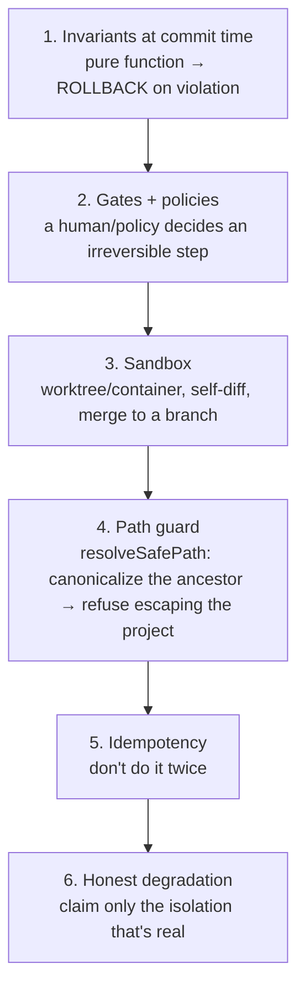

- **Invariants** catch "must not" structurally (not by prompt): "cannot approve with an open
  blocker", "touched the tests → a human is required".
- **Gates** are where the human is on the dial; the policy-function scales from "approve everything"
  to "let it run" with no switch in the kernel.
- **Sandbox + path guard** — the agent cannot leave the project (canonicalizing the *longest
  existing ancestor* of a path catches even a symlink-to-outside on a not-yet-existing file).
- **Merge to a branch only** (`loom/<task>`) — your checked-out branch is untouchable.

**The honest boundary:** the kernel guarantees the **process** (the declared review ran, nothing was
bypassed, an irreversible step got a human). It does **not** guarantee the *correctness of the
model's output* — that's the agents' job. The value is the ability to *prove* which process ran.

---

## 12. The control plane: supervisor and fleet

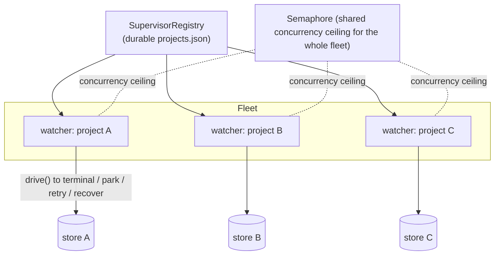

- **`superviseWatch`** per project: drive to terminal → on complete, merge-back + GC; on a gate,
  park + `waitForWake`; on error, retry by code (transient → backoff; rate-limit → a long wait;
  else escalate); recover-on-start.
- **`SupervisorRegistry`** = N such workers from one process + a **shared semaphore** (a ceiling on
  concurrent spawns across the whole fleet — the subscription rate-limit guard) + a per-project lock
  (so a stray `loom daemon` and the control plane never double-drive one project) + a durable project
  set (a restart re-attaches the whole fleet).
- **Transports** over the one `drive()`: `mcp-server` (stdio, the `/task /done /resume` commands),
  `cli` (`loom run`), `daemon`, `server` (HTTP + SSE + dashboard). The read-model for the UI is
  **domain-blind**: it reads only generic FSM fields (status/flow/phases/pending), never
  `bundle_state`.

---

## 13. Domain-blindness and extensibility

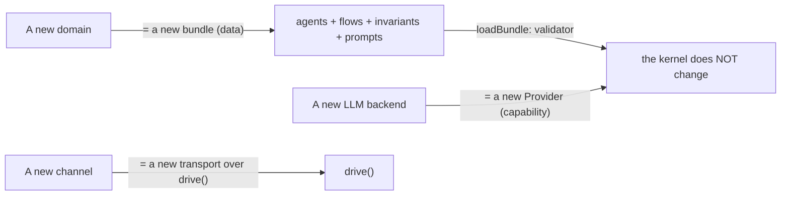

- **The kernel contains no** vendor/model/transport names (a CI grep `anthropic|openai` over the
  kernel = empty; naming `TransportResponse` in the kernel is forbidden — the kernel returns a
  `KernelDirective`, the transport gives it shape).
- **A new domain = a new bundle** (agents/flows/invariants as data) → the kernel is unchanged.
  Proven: a second, non-code bundle drives to finalize on the unmodified kernel (the genericity
  harness).
- **A new backend** is chosen by *capability*, not by name; the dispatcher routes per-spawn.
- **Blindness enforced at the CI level:** `no-domain-leak` greps (the control plane never reads the
  domain's `.stack`), `no-ambient-clock` (the kernel never reads the clock), a ban on internal
  jargon in public artifacts.

---

## 14. Key decisions and trade-offs (brief, ADR-style)

| Decision | Why | What it costs |
|---|---|---|
| **SQLite (WAL) as state** | atomicity, durability, observability (`sqlite3 state.db`), zero infra | one-file-per-project; cross-process WAL visibility needs checkpoint discipline |
| **Zero runtime deps in the kernel** | safety, "thin substrate", easy to audit | some validation by hand, not a library (but determinism) |
| **NowToken (clock once per tick)** | deterministic replay | discipline: `Date.now()` banned in the kernel (CI grep) |
| **One task per project** | a simple concurrency/recovery model | parallelism only at the project level; multi-task in one project is separate work |
| **Co-committed idempotency ledger** | crash-safety without reconciliation | a ledger row on every boundary-crossing op |
| **Executor seam (drive is backend-blind)** | any provider/harness with no kernel change | "the dirt of the world" lives in the driver, not the kernel (that's the goal) |
| **Sandbox = a full CoW copy, not a worktree** | the agent has deps+codegen; doesn't flail | the copy includes `.git`; on a non-CoW FS it's heavier |
| **Directive ≠ TransportResponse** | the kernel doesn't know the wire | the transport must "give it shape" (one composition does it for all) |
| **Policy as a function, no switch on names** | new policies = new factories, the kernel untouched | a policy must be pure/deterministic |

---

## 15. Design Q&A — common questions, crisp answers

- **"What is it and why?"** — A durable, reproducible FSM engine for multi-step LLM agents with
  human-in-the-loop, commit-time safety invariants, and audit-as-the-product. For work where "being
  wrong is expensive".
- **"How do you get determinism?"** — The model is moved out into the Executor seam (its answer is
  an *input*, not part of the machine), the clock is read exactly once per tick as a `NowToken` and
  threaded everywhere; the kernel is a pure transition function. The same
  `(state, NowToken, ledger)` → the same trajectory. CI forbids `Date.now()` in the kernel.
- **"How do you survive crashes?"** — The idempotency ledger is co-committed in the same transaction
  as the effect. A re-delivery returns the cached response and does not re-tick the machine.
  Recovery = "restart and let the ledger dedup".
- **"Why SQLite and how about concurrency?"** — WAL (readers don't block the writer) + a pool of
  "one connection per operation" (a nested transaction is impossible by construction) +
  `BEGIN IMMEDIATE` → a typed `STATE_BUSY` on contention. Migrations under the lock with a version
  re-read inside the lock.
- **"How do you add a new domain without changing the kernel?"** — The domain is data: a bundle of
  agents, flows, stages, and invariants. The kernel accepts any `Bundle`. Three orthogonal axes
  (bundle/provider/transport). Proven by a second bundle.
- **"How is safety enforced, not promised by a prompt?"** — Invariants — pure functions over state —
  run *inside* the transaction and roll it back. Plus gates, the sandbox, the path guard, merge to a
  branch. "An agent cannot rewrite the tests it's judged by and approve itself".
- **"How do you scale to many projects?"** — `SupervisorRegistry`: N watcher loops from one process,
  a shared semaphore (a ceiling on concurrent spawns across the fleet = the rate-limit guard), a
  per-project lock, a durable set for re-attaching after a restart.
- **"What does 'transactional atomicity' mean here?"** — All writes go through
  `withStateTransaction(projectDir, now, fn)`: one `BEGIN IMMEDIATE`, the mutation + the audit row +
  the ledger row co-commit, invariants run before COMMIT, any throw → ROLLBACK.
- **"The hardest thing you solved?"** — Cross-process visibility of a freshly-created schema in WAL
  (checkpoint discipline + a migration version re-read inside the lock) and crash-safe delivery
  (a co-committed ledger + the replay-guard). That's what separates "works in a demo" from "survives
  prod".

---

## 16. Glossary

- **Tick** — one turn of the FSM: load → runFSM → directive → atomic write.
- **Directive** — what the transport must do next (run an agent / ask a question / finalize). The
  kernel returns it; the transport gives the response its shape.
- **NowToken** — an ISO-8601 time token, minted once per tick, the basis of replay.
- **Carrier** — what carries an agent's result into the kernel (the input + the file delta).
- **Self-diff** — a git diff of the sandbox against the baseline → the honest list of changed files.
- **Merge-back** — extracting the work to a `loom/<task>` branch (never into your branch).
- **Read-model** — a domain-blind projection of state for the UI/CLI.
- **Park / wake** — a task stopped at a human gate / woken by an answer.
- **Idempotency ledger** — the boundary-op dedup table, co-committed with the effect.

---

*This document describes the architecture as pure engineering. Design rationale for individual
decisions lives in [WHITEPAPER.md](WHITEPAPER.md).*
