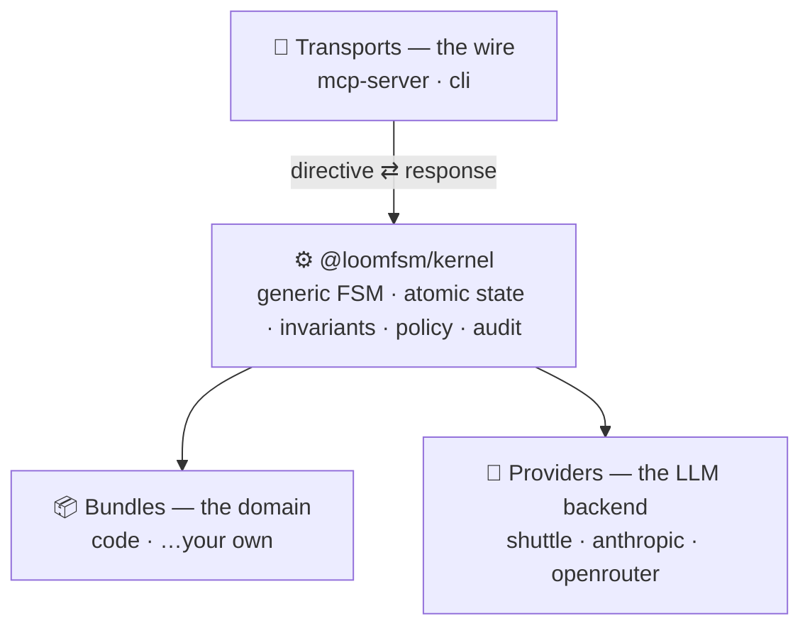

<div align="center">

# 🧵 loom

**Durable, auditable orchestration for LLM agents.**

Multi-step agent work — code review, implementation, any review-gated task — driven as a
replay-deterministic state machine, with human approval gates and safety guarantees
enforced at commit time, not hoped for from the model.

[](https://www.npmjs.com/package/@loomfsm/pipeline)
[](LICENSE)
[](.nvmrc)
[](#)

[Quickstart](#quickstart) · [Why loom](#why-loom) · [What you can build](#what-you-can-build) · [How it works](#how-it-works) · [Whitepaper](WHITEPAPER.md)

</div>

---

## The one-minute version

You hand loom a task. It drives a sequence of LLM agents through phases —
**classify → plan → implement → review → finalize** — committing every step
atomically to a local SQLite database. Humans approve at the gates that matter. The
whole run is recorded and replayable, and a set of invariants makes certain failures
*structurally impossible*: an agent can't sign off while a blocking issue is open, or
rewrite the tests it's being judged by and self-approve.


*You approve at the gates — after **classify**, after **plan**, and before **finalize** —
or hand the dial to `on-blockers` / full `auto`. Every step commits atomically to SQLite
and is replayable.*

Think **"Temporal for LLM agents"** — but with human-in-the-loop, structured review,
and provable safety as first-class primitives, not bolted on.

It runs inside your existing agent host (e.g. Claude Code) over MCP. No new app to
learn: you type `/task …`, approve gates as they come, and `/done` shows the result.

> The name reflects the design: state is the **warp**, agents are the **weft**,
> providers are the **shuttle**. One state-machine tick = one pick of the loom,
> committed atomically.

## Why loom

**🔁 Replay-deterministic and fully auditable.** State lives in atomic SQLite
transactions with a single timestamp token threaded through every step, so a run is
reproducible bit-for-bit. Every spawn, finding, verdict, and gate is recorded — open
the database and see exactly what happened and why. You can even replay a recorded run
against a *changed* invariant to ask "what if". The audit trail is the product, not an
afterthought.

**🛡️ Safety enforced at commit time, not promised by a prompt.** Invariants run inside
the transaction and roll it back on violation. The `code` bundle ships ones like
*"acceptance cannot pass while a blocking finding is open"* and *"if an agent touched
the test files, the final gate must be human-approved"* — so an autonomous agent can't
quietly rewrite the tests it's judged by and approve itself. Structural guarantees, not
behavioral hopes.

**🎚️ Human-in-the-loop, on a dial.** Gates are a primitive, and a policy decides each
one: `human` (approve every step), `on-blockers` (ask only when there's a real blocker
— the default), or `auto` (full autonomy, backed by a deterministic safety floor that
only wakes up in auto mode). One bundle scales from "approve everything" to "let it
run" — a built-in trust ramp you tighten or loosen as you go.

**🔌 Pluggable by design.** Three orthogonal axes: **bundles** (the domain — agents,
phases, gates, invariants), **providers** (the LLM backend), **transports** (the wire).
Any combination is valid at the kernel boundary. A new domain is a new bundle; the
kernel never changes.

**🚀 Zero-config to start, no lock-in.** The default provider runs through your agent
host — no API key, no network setup. State is plain SQLite you own. The kernel contains
no vendor, model, or transport names (enforced by CI). Apache 2.0.

**💥 Crash-safe.** Same `(state, timestamp, ledger)` → same trajectory. Recovery is
"restart and let the idempotency ledger dedup" — no half-applied steps, no reconciliation
loop.

> **What it guarantees — honestly.** loom guarantees the *process*: the declared review
> ran, nothing was bypassed, irreversible steps got a human. It does **not** guarantee
> the model's *output* is correct — that's the agents' job. What you get is the ability
> to *prove* which process ran and to *see* every decision behind a result.

## Quickstart

```bash
npm i -g @loomfsm/pipeline
```

Register it with your agent host and authorize a project:

```bash
loom setup            # writes the MCP server config + installs the /task and /done commands
loom allowlist add    # authorize the current project (run once per project)
```

Then, from your MCP host (e.g. Claude Code), inside that project:

```
/task add rate limiting to the login endpoint
```

loom classifies the task, plans it, implements it, runs a reviewer panel, validates,
and surfaces each approval gate for your decision. `/done` shows the summary. State
lives at `<project>/.claude/state.db` — a plain SQLite file.

```
loom setup [--user|--project] [--dry-run] [--force]   register the server + install /task,/done
loom allowlist add [path] [--dry-run]                 authorize a project directory
loom allowlist list                                   show authorized directories
loom init [--dry-run]                                 ensure .claude/ + authorize this project
loom --help | --version
```

Setup is idempotent — re-running changes nothing and never overwrites a command you've
edited. The allowlist is default-deny and operator-authored: the server never enrolls a
project on its own.

## What you can build

loom is for **high-stakes, multi-step, review-gated work where being wrong is
expensive** — not throwaway one-shot prompts. The shipping `code` bundle does
multi-agent code review and implementation; the same substrate fits any domain where
process, review, and audit matter:

- **Code review & implementation** *(ships today)* — plan-grounding checks, an
  adversarial reviewer panel, a final human gate.
- **Regulated / compliance work** (finance, KYC, records) — the replayable audit trail
  and enforced gates are the deliverable.
- **Legal / clause review** — draft → per-clause fanout → compliance invariant → human gate.
- **Incident runbooks** — deterministic stages with human gates on irreversible actions.
- **Content & publishing** — draft → fact-check → style → legal → publish gate.
- **Data migrations** — discover → transform in isolation → verify gate.

A new domain is a new bundle (agents + flows + invariants, authored as data). The kernel
doesn't change.

## How it works

The kernel is generic — it knows nothing about code review or any domain. Three
orthogonal axes plug into it: **bundles** (the domain), **providers** (the LLM backend),
and **transports** (the wire). Any combination is valid.



And the core vocabulary:

- **Stage** — one of five variants (`SpawnStage`, `FanoutStage`, `GateStage`,
  `StepStage`, `FinalizeStage`). A bundle's `flows` map names sequences of stages.
- **Gate** — a checkpoint whose outcome a **Policy** decides. Roles: `classify`, `plan`,
  `final` (kernel-recognized; bundles add more).
- **Policy** — a function `(state, role, ctx) → Decision`. The kernel never switches on
  policy names; the function *is* the contract. Stock factories: `human`, `on-blockers`,
  `auto`.
- **Invariant** — a pure function over state, called in-transaction; a violation rolls
  the transaction back. Kernel-generic ones plus bundle-declared safety rules.
- **Provider** — the LLM backend, chosen by *capability*, not name. Per-agent / per-phase
  routing.

Full design rationale in [WHITEPAPER.md](WHITEPAPER.md).

## At a glance

| | |
|---|---|
| Language | TypeScript (Node 22+, pnpm workspaces) |
| State | SQLite (WAL, `BEGIN IMMEDIATE`), atomic per kernel call |
| Determinism | Replay-deterministic via a persisted timestamp token |
| Idempotency | Co-committed ledger keyed per boundary-crossing op |
| Autonomy | `Policy = (state, role, ctx) → Decision` — three stock factories |
| Default policy | `on-blockers` — asks a human only when a blocking finding exists |
| Providers | `claude-code-shuttle` (zero-config), `anthropic-sdk`, `openrouter` |
| Transports | `mcp-server` (stdio), `cli`; daemon planned |
| License | Apache 2.0 |

## Repository layout

```
packages/
  kernel/                  FSM, invariants, ledger, gate-policy, types — no vendor names
  mcp-server/              MCP transport (stdio); the /task and /done commands
  cli/                     the `loom` install binary (setup / allowlist / init)
  pipeline/                @loomfsm/pipeline — the one-step `npm i -g` meta-package
  providers/
    claude-code-shuttle/   default provider, no API key needed
    anthropic-sdk/         direct Anthropic with prompt-caching + idempotent spawn
    openrouter/            multi-model routing
  bundles/
    code/                  the code-review / implementation bundle
```

Published under the `@loomfsm/*` scope: `@loomfsm/pipeline` (install this), plus
`@loomfsm/{kernel,mcp-server,cli,bundle-code,provider-claude-code-shuttle,provider-anthropic-sdk,provider-openrouter}`.

## What it isn't

- Not a prompt-template framework — templates live in bundles, typed and validated.
- Not an agent IDE — it runs underneath your IDE / shell / MCP host.
- Not a distributed runtime — single in-flight task per project, by design.
- Not "AGI plumbing" — a finite-state machine that survives crashes and tells you what happened.

## Status & roadmap

`v0.1.2`: kernel + the `code` bundle + three providers + mcp-server & cli; one task per
project; published on npm. Early and evolving. On the near horizon: richer host/driver
integration, more bundles, bundle runtime isolation, a cross-task memory subsystem, and
a daemon transport. The substrate is *additive* to all of these — none reshapes the kernel.

## Contributing

- `pnpm -r typecheck` and `pnpm -r test` must be green before a change is done — the floor.
- Tests ship with the code they cover. No "tests later."
- Conventional-commit subjects (`feat:` / `fix:` / `chore:` / `refactor:` / `docs:`).
- The kernel carries no provider, transport, or model names — a CI grep enforces it.

## License

Apache 2.0 — see [LICENSE](LICENSE). Permissive, with an explicit patent grant.

## Further reading

- [WHITEPAPER.md](WHITEPAPER.md) — the design, in prose. Read this before opening a PR.
