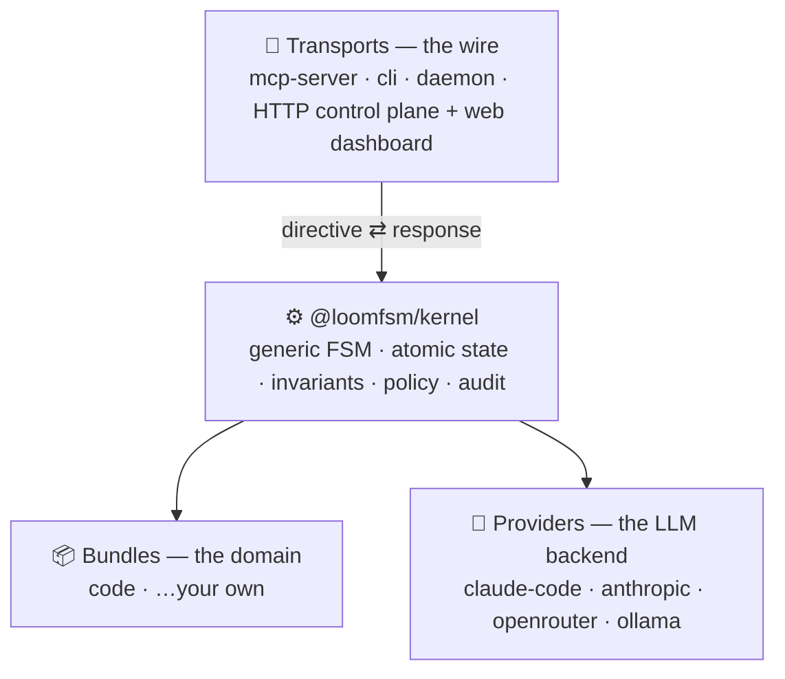

<div align="center">

# 🧵 loom

**Durable, auditable orchestration for LLM agents.**

loom drives multi-step agent work — code review, implementation, any review-gated task —
as a replay-deterministic state machine: human approval gates where they matter, safety
invariants enforced at commit time, and a complete audit trail you can replay.

[](https://www.npmjs.com/package/@loomfsm/pipeline)
[](LICENSE)
[](.nvmrc)
[](#)

[Quickstart](#quickstart) · [Running loom](#running-loom) · [Configure once](#configure-once-any-model-any-provider) · [Why loom](#why-loom) · [How it works](#how-it-works) · [Whitepaper](WHITEPAPER.md)

</div>

---

## What is loom

You hand loom a task. It drives a sequence of LLM agents through phases —
**classify → plan → implement → review → validate → finalize** — committing every step
atomically to a local SQLite database. You approve at the gates that matter; everything
else runs on its own. The whole run is recorded and replayable, and a set of invariants
makes certain failures *structurally impossible*: an agent can't sign off while a blocking
issue is open, or rewrite the tests it's judged by and self-approve.


It runs **four ways** — all driving the *identical* state machine, gates, and invariants:

| | mode | when to use |
|---|---|---|
| 🖥️ | **Web dashboard** — `loom up` | a browser console for the whole fleet — submit, watch, approve, configure |
| 💬 | **Inside your agent host** — `/task …` | zero setup; runs through Claude Code, no API key |
| ⚡ | **Headless one-shot** — `loom run "…"` | drive one task to the end from a terminal |
| 🤖 | **Autonomous daemon** — `loom daemon` | set-and-forget; parks on your gates, wakes when you answer |

Think *"Temporal for LLM agents"* — but with human-in-the-loop, structured review, and
provable safety as first-class primitives.

## Quickstart

```bash
npm i -g @loomfsm/pipeline      # installs the `loom` CLI and everything it needs
```

**Fastest path — the web dashboard:**

```bash
loom up        # starts the local control plane and opens the dashboard in your browser
```

The dashboard opens at `http://127.0.0.1:4317` with a first-run wizard that walks you
through choosing a backend, adding a project, and submitting your first task.

**Or, inside your agent host (Claude Code):**

```bash
loom setup            # register the MCP server + install the /task, /done, /resume commands
loom allowlist add    # authorize the current project (run once per project; default-deny)
```

then, in that project:

```
/task add rate limiting to the login endpoint
```

State lives at `<project>/.claude/state.db` — a plain SQLite file you own. `loom setup` is
idempotent and never overwrites a command you've edited.

## Running loom

Every mode drives the same engine; they differ only in *who executes each step* and *how
long it waits for you*.

### 1 · Web dashboard — `loom up`

One local server supervises a fleet of projects and serves a web UI you drive from the
browser. `loom up` starts it and opens the page; a bare `loom` (no arguments) does the same.

```bash
loom up                                  # start + open the browser at http://127.0.0.1:4317
loom up --no-open                        # start without opening a browser (SSH/headless — open the URL yourself)
loom up --port 8080                      # bind a different port
loom up --token "$(openssl rand -hex 16)"  # require a bearer token on the API
```

From the dashboard you can:

- **browse projects** and their live status — running (pulsing), parked at a gate, or stalled — even when idle, with total elapsed time;
- **submit a task**, choose its supervision policy, and **flag it ⚡ fast** for a single-pass run (or pick a complexity) — plus an optional **run-in-Docker** checkbox when the server can sandbox;
- **pause / resume / cancel** a task — pause stops spending but keeps progress (resume re-drives from where it left off); cancel frees the slot in one click;
- **answer a gate** (accept / reject / auto-apply) and **tail a human-readable live log** over SSE (timestamps, level chips, `key value` detail), with tokens / turns / cache as the primary cost signal;
- **configure once** — edit global config, secrets (write-only, shown masked), and the per-agent model map (provider + model dropdowns with a live model list, free-text fallback) through forms generated from the config schema;
- **see providers** and which backends are available.

**Auth & scope.** The server binds loopback (`127.0.0.1`) by default. Pass `--token` (or set
`LOOM_SERVER_TOKEN`) to require `Authorization: Bearer …` on every API call — the dashboard
prompts for the token and keeps it in `localStorage`. This is a localhost operator console,
not a multi-tenant service.

**Headless / always-on.** `loom serve` is the same control plane *without* opening a browser
— for a remote box or a long-running supervisor:

```bash
loom serve --project ./my-service --token "$TOKEN"   # supervise a fleet over HTTP
loom serve status                                    # running? where does it bind? how many projects?
loom serve stop
```

### 2 · Inside your agent host — `/task`

The zero-setup path: your host (Claude Code) executes each agent step, and loom surfaces
each gate inline for your decision. No API key, no network setup.

```
/task add rate limiting to the login endpoint   # start a task
/resume                                          # re-attach to a task that was interrupted
/done                                            # show the result + clear the slot
```

### 3 · Headless one-shot — `loom run`

Drive a task to the end from a terminal, no live host:

```bash
loom run "add rate limiting to the login endpoint"
```

By default each step runs through the Claude Code CLI (`claude -p`) in an **isolated git
worktree**, on your existing Claude Code login — your subscription, **no API key**. A genuine
human gate **pauses** and is printed for you to answer; otherwise it runs straight to a
verdict. Your main working tree is never touched. (To run on other models/providers, see
[Configure once](#configure-once-any-model-any-provider).)

### 4 · Autonomous daemon — `loom daemon`

A long-lived supervisor over the headless loop — the "set it and check back" mode:

```bash
loom daemon start "migrate the auth module to the new SDK"
loom daemon status     # running? driving / parked at a gate / backing off?
loom daemon stop
```

It runs the work server-side and surfaces you **only at decision points**:

- **parks** on a human gate and **wakes** when you answer it,
- **retries** transient failures with exponential backoff,
- **recovers** an interrupted task on restart (a slept laptop / killed process just resumes — same agent ids, idempotent re-delivery, no double work),
- **commits** finished work to a `loom/<task>` branch — reviewable, **never** auto-merged.

`--watch` keeps supervising the slot for the next task; `--detach` runs it in the background.

### Container isolation for unattended runs (`--docker`)

The git-worktree default isolates the *file tree* but not the process. For "leave it
running" autonomy, `--docker` runs each spawn inside a container that mounts **only** a
dedicated clone of the project (never your live checkout) plus the one credential needed to
sign in — a real blast-radius bound.

```bash
export LOOM_DOCKER_IMAGE=loom-claude:latest             # image with the Claude Code CLI + git (see docker/)
export CLAUDE_CODE_OAUTH_TOKEN="$(claude setup-token)"  # subscription token, NOT an API key
loom run --docker "refactor the payment module"         # require the fence: no fence, no run
loom daemon start --docker --watch                      # autonomous, fenced
```

Default is `auto` (use Docker if available, else fall back to the worktree with a loud
notice); `--docker` requires it; `--no-docker` forces the worktree. loom claims only the
isolation it actually provides. A reference image is in [`docker/`](docker/).

### CLI reference

```
# run
loom up [--no-open] [--port p] [--token t] [--project dir]...   start the control plane + open the dashboard
loom serve [--project dir]... [--host h] [--port p] [--token t] [--detach] [--docker|--no-docker]
loom serve stop | status
loom run "<task>" [--docker|--no-docker]                        drive one task to the end (headless)
loom daemon start [--watch] [--detach] [--docker] ["<task>"]    supervise a project: park/wake, retry, recover
loom daemon stop | status [path]

# configure once (global; every project inherits it)
loom config get [key] | set <key> <value>                       backend mode + notify / resilience defaults
loom secrets set <name> <value> | list                          machine-local secret store (chmod 600); masked on list
loom models set <agent> <provider:model|tier> | list            bind a bundle's agents to models
loom projects add [path] [--label <l>] | list | remove <id>     the catalog of projects you've worked on

# host setup & project lifecycle
loom setup [--user|--project] [--dry-run] [--force]             register the MCP server + /task,/done,/resume
loom allowlist add [path] [--dry-run] | list                    authorize a project directory (default-deny)
loom init [--dry-run]                                           ensure .claude/ + authorize this project
loom status  [path]                                             read-only snapshot of the task (flags a stall)
loom reset   [path] [--force] [--dry-run]                       archive a finished task, free the slot
loom history [path]                                             list this project's archived tasks
loom --help | --version
```

## Configure once: any model, any provider

loom resolves a backend **per spawn**. Set your keys and a per-agent model map *once* —
from the CLI or the dashboard — and every project inherits it.

```bash
loom config set backend auto                  # auto: Claude Code CLI if present, else a configured provider
loom secrets set OPENROUTER_API_KEY sk-...     # stored chmod 600, referenced as secret:<name>, never printed
loom models set implementer openrouter:deepseek/deepseek-chat   # bind an agent to a model
loom models list                               # show each agent's effective model
```

- **`auto`** prefers the Claude Code CLI when present (your subscription, no key) and falls
  back to a configured provider — **OpenRouter**, **Ollama** (local), or **Anthropic**.
- Decision agents (classify, review) run as a single model call; a **file-editing** agent
  runs through an agentic-CLI harness — **Aider** or **opencode** — behind the same
  isolated-worktree seam as `claude -p`, so an implementer can run on DeepSeek via OpenRouter
  or a local Ollama model and actually edit files. The harness is chosen by a generic,
  bundle-declared capability (*does this agent edit files?*), never by name.
- The dashboard edits this same layer through schema-generated forms (config, masked secrets,
  the model map) — nothing is UI-only.

> Per-spawn multi-backend dispatch is validated against real non-Claude models, with
> hardening continuing. The zero-config default still runs through your Claude Code login.

## Why loom

**🔁 Replay-deterministic and fully auditable.** State lives in atomic SQLite transactions
with a single timestamp token threaded through every step, so a run is reproducible
bit-for-bit. Every spawn, finding, verdict, and gate is recorded — open the database and see
exactly what happened. You can even replay a recorded run against a *changed* invariant to
ask "what if". The audit trail is the product, not an afterthought.

**🛡️ Safety enforced at commit time, not promised by a prompt.** Invariants run inside the
transaction and roll it back on violation. The `code` bundle ships rules like *"acceptance
can't pass while a blocking finding is open"* and *"if an agent touched the test files, the
final gate must be human-approved"* — so an autonomous agent can't quietly rewrite the tests
it's judged by and approve itself.

**🎚️ Human-in-the-loop, on a dial.** A policy decides each gate: `human` (approve every
step), `on-blockers` (ask only on a real blocker — the default), or `auto` (full autonomy
with a deterministic safety floor). One bundle scales from "approve everything" to "let it
run".

**🔌 Pluggable by design.** Three orthogonal axes — **bundles** (the domain), **providers**
(the LLM backend), **transports** (the wire). Any combination is valid at the kernel
boundary; a new domain is a new bundle and the kernel never changes. The kernel contains no
vendor, model, or transport names (enforced by CI).

**💥 Crash-safe.** Same `(state, timestamp, ledger)` → same trajectory. Recovery is "restart
and let the idempotency ledger dedup" — no half-applied steps, no reconciliation loop. The
daemon turns this into a feature: a drop just pauses it, and it resumes on its own.

> **What it guarantees — honestly.** loom guarantees the *process*: the declared review ran,
> nothing was bypassed, irreversible steps got a human. It does **not** guarantee the model's
> *output* is correct — that's the agents' job. What you get is the ability to *prove* which
> process ran and to *see* every decision behind a result.

## What you can build

loom is for **high-stakes, multi-step, review-gated work where being wrong is expensive** —
not throwaway one-shot prompts. The shipping `code` bundle does multi-agent code review and
implementation. The same substrate fits any domain where process, review, and audit matter:
regulated/compliance work, legal clause review, incident runbooks, content pipelines, data
migrations. A new domain is a new bundle (agents + flows + invariants, authored as data) —
the kernel doesn't change.

## How it works

The kernel is generic — it knows nothing about code review or any domain. Three orthogonal
axes plug into it, and any combination is valid:



A shared runtime, `@loomfsm/driver`, holds the transport-neutral orchestration loop
(`drive()`) that `loom run`, the daemon, and the HTTP control plane all wrap — so the
directive contract is implemented once and every transport behaves identically.

Core vocabulary:

- **Stage** — one of five variants (`SpawnStage`, `FanoutStage`, `GateStage`, `StepStage`, `FinalizeStage`). A bundle's `flows` name sequences of stages.
- **Gate** — a checkpoint whose outcome a **Policy** decides. Roles: `classify`, `plan`, `final` (bundles add more).
- **Policy** — a function `(state, role, ctx) → Decision`. The kernel never switches on policy names; the function *is* the contract. Stock factories: `human`, `on-blockers`, `auto`.
- **Invariant** — a pure function over state, called in-transaction; a violation rolls it back.
- **Provider** — the LLM backend, chosen by *capability*, not name; per-agent / per-phase routing.

Full design rationale in [WHITEPAPER.md](WHITEPAPER.md).

## At a glance

| | |
|---|---|
| Language | TypeScript (Node 22+, pnpm workspaces) |
| State | SQLite (WAL, `BEGIN IMMEDIATE`), atomic per kernel call |
| Determinism | Replay-deterministic via a persisted timestamp token |
| Idempotency | Co-committed ledger keyed per boundary-crossing op |
| Autonomy | `Policy = (state, role, ctx) → Decision` — three stock factories |
| Default policy | `on-blockers` — asks a human only when a blocking finding exists |
| Concurrency | One task in flight per project; finished tasks archive to `.claude/history/` |
| Providers | `claude-code-shuttle` (zero-config), `anthropic-sdk`, `openrouter`, `ollama` |
| Transports | `mcp-server` (stdio), `cli`, `daemon`, and an HTTP control plane + web dashboard |
| License | Apache 2.0 |

## Packages

Install **`@loomfsm/pipeline`** — the one-step meta-package that pulls the runtime (kernel,
driver, daemon, server, web dashboard, mcp-server, cli, the `code` bundle, and the zero-config
provider). The `anthropic-sdk` / `openrouter` / `ollama` providers also publish and install on
demand, so the base install stays lean.

```
packages/
  kernel/         generic FSM, invariants, ledger, gate-policy, types — no vendor names
  config/         configure-once control layer — keys, per-agent model map, project catalog
  driver/         orchestration runtime — drive() loop, Executor seam, backend executors (claude -p, container, aider/opencode)
  daemon/         long-lived supervisor over drive() — park/wake, retry, recovery, merge-back
  server/         HTTP control plane — submit / read-model / answer / SSE, multi-project
  dashboard/      React web control plane (SPA), served as prebuilt static assets by the server
  mcp-server/     MCP transport (stdio); the /task, /done, /resume commands
  cli/            the `loom` binary
  pipeline/       @loomfsm/pipeline — the one-step `npm i -g` meta-package
  providers/      claude-code-shuttle (default) · anthropic-sdk · openrouter · ollama
  bundles/        code — the code-review / implementation bundle
```

## What it isn't

- Not a prompt-template framework — templates live in bundles, typed and validated.
- Not an agent IDE — it runs underneath your IDE / shell / MCP host.
- Not a distributed runtime — single in-flight task per project, by design.
- Not "AGI plumbing" — a finite-state machine that survives crashes and tells you what happened.

## Status

**`v0.3.0` (current):** configure once, any model, drive it from a browser, and run without
Claude. Adds the configure-once control layer (`loom config / secrets / models`), per-spawn
multi-backend resolution (`auto` is Claude-Code-first, else OpenRouter / Ollama / Anthropic),
non-Claude file-editing harnesses (Aider / opencode), and the **web dashboard** with
one-command `loom up`.

Previously: the HTTP control plane, container isolation, and unattended hardening
(rate-limit/timeout handling, outbound notifications) in `0.2.1`; headless `loom run` + the
autonomous `loom daemon` in `0.2.0`; the interactive kernel + `code` bundle + MCP/CLI in
`0.1.x`. Every layer is additive over the same `drive()` loop, with zero kernel change.

## Contributing

`pnpm -r typecheck` and `pnpm -r test` must be green before a change is done — the floor.
Licensed under [Apache 2.0](LICENSE).
