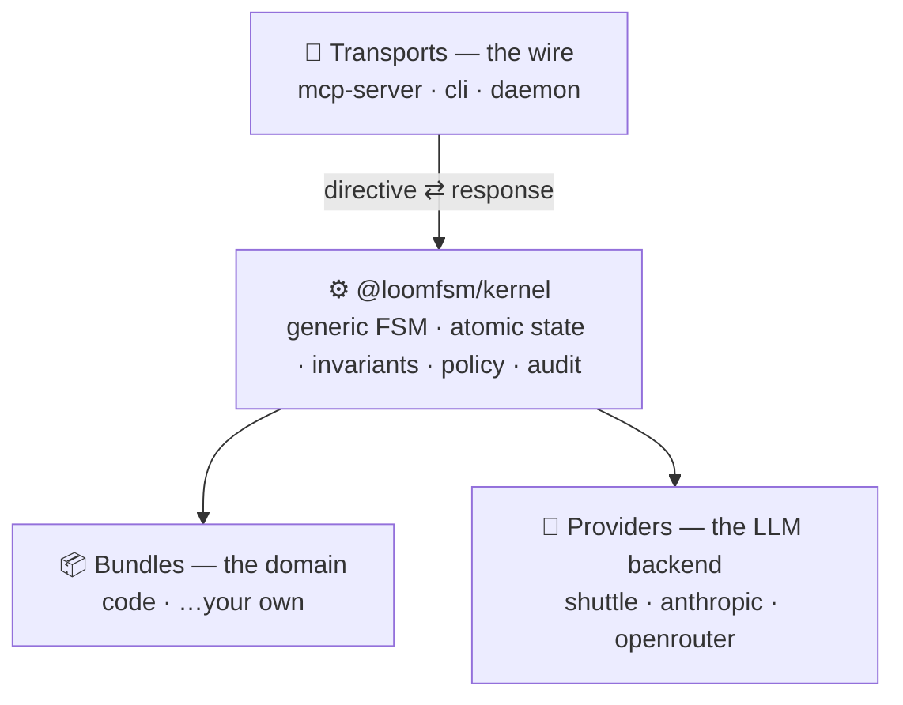

<div align="center">

# 🧵 loom

**Durable, auditable orchestration for LLM agents.**

Multi-step agent work — code review, implementation, any review-gated task — driven as a
replay-deterministic state machine, with human approval gates and safety guarantees
enforced at commit time, not hoped for from the model.

Run it **interactively** inside your agent host, **headless** as a one-shot command, or
as a **self-driving daemon** that parks on your gates and wakes when you answer.

[](https://www.npmjs.com/package/@loomfsm/pipeline)
[](LICENSE)
[](.nvmrc)
[](#)

[Quickstart](#quickstart) · [How you run it](#how-you-run-it) · [Why loom](#why-loom) · [What you can build](#what-you-can-build) · [How it works](#how-it-works) · [Whitepaper](WHITEPAPER.md)

</div>

---

## The one-minute version

You hand loom a task. It drives a sequence of LLM agents through phases — roughly
**classify → plan → implement → review → validate → finalize** — committing every step
atomically to a local SQLite database. Humans approve at the gates that matter. The
whole run is recorded and replayable, and a set of invariants makes certain failures
*structurally impossible*: an agent can't sign off while a blocking issue is open, or
rewrite the tests it's being judged by and self-approve.


*You approve at the gates — after **classify**, after **plan**, and before **finalize** —
or hand the dial to `on-blockers` / full `auto`. Every step commits atomically to SQLite
and is replayable.*

Think **"Temporal for LLM agents"** — but with human-in-the-loop, structured review,
and provable safety as first-class primitives, not bolted on.

The same engine runs three ways: type `/task …` inside your agent host (e.g. Claude
Code), fire a one-shot `loom run "…"` from a terminal, or leave a `loom daemon` running
that drives work server-side and only surfaces you at decision points.

> The name reflects the design: state is the **warp**, agents are the **weft**,
> providers are the **shuttle**. One state-machine tick = one pick of the loom,
> committed atomically.

## Quickstart

```bash
npm i -g @loomfsm/pipeline
```

Register it with your agent host and authorize a project (one-time):

```bash
loom setup            # writes the MCP server config + installs the /task, /done, /resume commands
loom allowlist add    # authorize the current project (run once per project)
```

Then pick how you want to run it (next section). The fastest path — inside your MCP host
(e.g. Claude Code), in that project:

```
/task add rate limiting to the login endpoint
```

State lives at `<project>/.claude/state.db` — a plain SQLite file you own. Setup is
idempotent: re-running changes nothing and never overwrites a command you've edited. The
allowlist is default-deny and operator-authored — the server never enrolls a project on
its own.

## How you run it

Every mode drives the **identical** state machine, gates, and invariants. They differ
only in *who executes each step* and *how long it waits for you*.

### 1 · Interactive — inside your agent host

The zero-setup path: your host (Claude Code) executes each agent step, and loom surfaces
each gate inline for your decision.

```
/task add rate limiting to the login endpoint   # start a task
/resume                                          # re-attach to a task that was interrupted
/done                                            # show the result + clear the slot
```

No API key, no network setup — it runs through the host you already use.

### 2 · Headless one-shot — `loom run`

Drive a task to the end from a terminal, no live host:

```bash
loom run "add rate limiting to the login endpoint"
```

Each step runs through the Claude Code CLI (`claude -p`) in an **isolated git worktree**,
on your existing Claude Code login — your subscription, **no API key**. A genuine human
gate **pauses** and is printed for you to answer (`/resume` in the host); otherwise it
runs straight to a verdict. Your main working tree is never touched.

### 3 · Autonomous daemon — `loom daemon`

A long-lived supervisor over the headless loop — the "set it and check back" mode:

```bash
loom daemon start "migrate the auth module to the new SDK"
loom daemon status     # is it running? driving / parked at a gate / backing off?
loom daemon stop
```

It runs the work server-side and surfaces you **only at decision points**:

- **parks** on a human gate and **wakes** when you answer it (via `/resume`),
- **retries** transient failures with exponential backoff,
- **recovers** an interrupted task on restart (a slept laptop / killed process just
  resumes — same agent ids, idempotent re-delivery, no double work),
- **commits** finished work to a `loom/<task>` branch — reviewable, **never** auto-merged
  into your checked-out branch.

`--watch` keeps supervising the slot for the next task; `--detach` runs it in the
background.

### CLI reference

```
loom setup [--user|--project] [--dry-run] [--force]   register the MCP server + install /task,/done,/resume
loom allowlist add [path] [--dry-run]                 authorize a project directory (default-deny)
loom allowlist list                                   show authorized directories
loom init [--dry-run]                                 ensure .claude/ + authorize this project

loom run "<task>" [--docker|--no-docker]              drive a task to the end headless (claude -p, isolated worktree)
loom daemon start [--watch] [--detach] [--docker] ["<task>"]  supervise a project: park/wake, retry, recover, merge-back
loom daemon stop  [path]                              signal a running daemon to stop gracefully
loom daemon status [path]                             show the daemon + where the task sits

loom status  [path]                                   read-only snapshot of the project's task (flags a stalled run)
loom reset   [path] [--force] [--dry-run]             archive a finished task to .claude/history/, free the slot
loom history [path]                                   list this project's archived tasks
loom --help | --version
```

> `loom run` and `loom daemon` default to the Claude Code CLI installed and signed in (they
> run on your subscription, no API key). The interactive `/task` path doesn't even need that
> — it uses your host directly. Running on *other* backends (any provider/model, fully
> without Claude) is in development — see [Status & roadmap](#status--roadmap). The permission
> posture defaults to safe (`acceptEdits` — file edits proceed, shell stays gated); raise it
> deliberately with `LOOM_CLAUDE_PERMISSION_MODE`.

#### Container isolation — a real fence for unattended runs (`--docker`)

The git-worktree default isolates the *file tree* but not the process: a full-power
(`bypassPermissions`) agent could still reach the host filesystem, your other repos, and
your credentials. For "set it and forget it", `--docker` runs each spawn inside a
container that mounts **only** a dedicated clone of the project (never your live
checkout) plus the one credential needed to sign in — a real blast-radius bound that
makes full autonomy safe to leave running.

```bash
export LOOM_DOCKER_IMAGE=loom-claude:latest        # an image with the Claude Code CLI + git (see docker/)
export CLAUDE_CODE_OAUTH_TOKEN="$(claude setup-token)"   # subscription token, NOT an API key
loom run --docker "refactor the payment module"    # require the fence: no fence, no run
loom daemon start --docker --watch                 # autonomous, fenced
```

- **auto** (default): use Docker if it's available, else fall back to the worktree with a
  loud notice. `--docker` **requires** it (refuse cleanly when Docker / an image / a
  credential is missing); `--no-docker` forces the worktree.
- The agent works in a `git clone --local` of the project, so it has full git inside the
  fence; finished work is extracted to a `loom/<task>` branch exactly as the worktree
  path does — **your checked-out tree is never touched.**
- Honesty rule: loom claims only the isolation it actually provides. No Docker → it says
  so and degrades; it never runs unsandboxed while implying a sandbox.
- Knobs: `LOOM_DOCKER_IMAGE` (required), `LOOM_DOCKER_NETWORK`, `LOOM_DOCKER_USER`,
  `LOOM_CLAUDE_MAX_TURNS`. A reference image is in [`docker/`](docker/).

## Why loom

**🔁 Replay-deterministic and fully auditable.** State lives in atomic SQLite
transactions with a single timestamp token threaded through every step, so a run is
reproducible bit-for-bit. Every spawn, finding, verdict, and gate is recorded — open
the database and see exactly what happened and why. You can even replay a recorded run
against a *changed* invariant to ask "what if". The audit trail is the product, not an
afterthought.

**🛡️ Safety enforced at commit time, not promised by a prompt.** Invariants run inside
the transaction and roll it back on violation. The `code` bundle ships ones like
*"acceptance cannot pass while a blocking finding is open"* and *"if an agent touched
the test files, the final gate must be human-approved"* — so an autonomous agent can't
quietly rewrite the tests it's judged by and approve itself. Structural guarantees, not
behavioral hopes.

**🎚️ Human-in-the-loop, on a dial.** Gates are a primitive, and a policy decides each
one: `human` (approve every step), `on-blockers` (ask only when there's a real blocker
— the default), or `auto` (full autonomy, backed by a deterministic safety floor that
only wakes up in auto mode). One bundle scales from "approve everything" to "let it
run" — a built-in trust ramp you tighten or loosen as you go.

**🔌 Pluggable by design.** Three orthogonal axes: **bundles** (the domain — agents,
phases, gates, invariants), **providers** (the LLM backend), **transports** (the wire).
Any combination is valid at the kernel boundary. A new domain is a new bundle; the
kernel never changes.

**🚀 Zero-config to start, no lock-in.** The default provider runs through your agent
host — no API key, no network setup. State is plain SQLite you own. The kernel contains
no vendor, model, or transport names (enforced by CI). Apache 2.0.

**💥 Crash-safe.** Same `(state, timestamp, ledger)` → same trajectory. Recovery is
"restart and let the idempotency ledger dedup" — no half-applied steps, no reconciliation
loop. The daemon turns this into a feature: a drop just pauses it, and it resumes on its own.

> **What it guarantees — honestly.** loom guarantees the *process*: the declared review
> ran, nothing was bypassed, irreversible steps got a human. It does **not** guarantee
> the model's *output* is correct — that's the agents' job. What you get is the ability
> to *prove* which process ran and to *see* every decision behind a result.

## What you can build

loom is for **high-stakes, multi-step, review-gated work where being wrong is
expensive** — not throwaway one-shot prompts. The shipping `code` bundle does
multi-agent code review and implementation; the same substrate fits any domain where
process, review, and audit matter:

- **Code review & implementation** *(ships today)* — plan-grounding checks, an
  adversarial reviewer panel, a final human gate.
- **Regulated / compliance work** (finance, KYC, records) — the replayable audit trail
  and enforced gates are the deliverable.
- **Legal / clause review** — draft → per-clause fanout → compliance invariant → human gate.
- **Incident runbooks** — deterministic stages with human gates on irreversible actions.
- **Content & publishing** — draft → fact-check → style → legal → publish gate.
- **Data migrations** — discover → transform in isolation → verify gate.

A new domain is a new bundle (agents + flows + invariants, authored as data). The kernel
doesn't change.

## How it works

The kernel is generic — it knows nothing about code review or any domain. Three
orthogonal axes plug into it: **bundles** (the domain), **providers** (the LLM backend),
and **transports** (the wire). Any combination is valid.



A second runtime, `@loomfsm/driver`, holds the transport-neutral orchestration loop
(`drive()`) that both `loom run` and `loom daemon` wrap — so the directive contract is
implemented once and every transport behaves identically.

And the core vocabulary:

- **Stage** — one of five variants (`SpawnStage`, `FanoutStage`, `GateStage`,
  `StepStage`, `FinalizeStage`). A bundle's `flows` map names sequences of stages.
- **Gate** — a checkpoint whose outcome a **Policy** decides. Roles: `classify`, `plan`,
  `final` (kernel-recognized; bundles add more).
- **Policy** — a function `(state, role, ctx) → Decision`. The kernel never switches on
  policy names; the function *is* the contract. Stock factories: `human`, `on-blockers`,
  `auto`.
- **Invariant** — a pure function over state, called in-transaction; a violation rolls
  the transaction back. Kernel-generic ones plus bundle-declared safety rules.
- **Provider** — the LLM backend, chosen by *capability*, not name. Per-agent / per-phase
  routing.

Full design rationale in [WHITEPAPER.md](WHITEPAPER.md).

## At a glance

| | |
|---|---|
| Language | TypeScript (Node 22+, pnpm workspaces) |
| State | SQLite (WAL, `BEGIN IMMEDIATE`), atomic per kernel call |
| Determinism | Replay-deterministic via a persisted timestamp token |
| Idempotency | Co-committed ledger keyed per boundary-crossing op |
| Autonomy | `Policy = (state, role, ctx) → Decision` — three stock factories |
| Default policy | `on-blockers` — asks a human only when a blocking finding exists |
| Concurrency | One task in flight per project; finished tasks archive to `.claude/history/` |
| Providers | `claude-code-shuttle` (zero-config), `anthropic-sdk`, `openrouter`, `ollama` — all published; non-Claude work-agents via `aider` / `opencode` harness adapters |
| Transports | `mcp-server` (stdio), `cli`, the local-process `daemon`, and an HTTP control plane (`loom serve`) serving a React web dashboard |
| License | Apache 2.0 |

## Repository layout

```
packages/
  kernel/                  FSM, invariants, ledger, gate-policy, types — no vendor names
  config/                  configure-once control layer — keys, per-agent model map, project catalog (published)
  driver/                  orchestration runtime — drive() loop, Executor seam, and the backend executors (claude -p, container, aider / opencode harnesses)
  daemon/                  long-lived supervisor over drive() — park/wake, retry, recovery, worktree merge-back
  server/                  HTTP control plane — submit / read-model / answer / SSE, multi-project (published)
  dashboard/               React web control plane (SPA) — served as prebuilt static assets by the server (published)
  mcp-server/              MCP transport (stdio); the /task, /done, /resume commands
  cli/                     the `loom` binary (up / setup / allowlist / init / status / reset / run / daemon / serve / config / secrets / models / projects)
  pipeline/                @loomfsm/pipeline — the one-step `npm i -g` meta-package
  providers/
    claude-code-shuttle/   default provider, no API key needed (published)
    anthropic-sdk/         direct Anthropic with prompt-caching + idempotent spawn (published)
    openrouter/            multi-model routing (published)
    ollama/                local models (published)
  bundles/
    code/                  the code-review / implementation bundle
```

Published under the `@loomfsm/*` scope: install **`@loomfsm/pipeline`**, which pulls
`@loomfsm/{kernel, transport-types, config, driver, daemon, server, dashboard, mcp-server, cli, bundle-code, provider-claude-code-shuttle}`.
The `anthropic-sdk` / `openrouter` / `ollama` providers also publish and install on demand
(optional dependencies, so the base install stays lean). A second bundle used as a
genericity fixture stays in-repo.

## What it isn't

- Not a prompt-template framework — templates live in bundles, typed and validated.
- Not an agent IDE — it runs underneath your IDE / shell / MCP host.
- Not a distributed runtime — single in-flight task per project, by design.
- Not "AGI plumbing" — a finite-state machine that survives crashes and tells you what happened.

## Status & roadmap

`v0.3.0` (current): **configure once, any model, drive it from a browser, and run without
Claude.** A control layer (`@loomfsm/config`) lets you set API keys and a per-agent model map
*once*, globally, and keep a browsable project catalog — all from the CLI
(`loom config / secrets / models / projects`). Backend is then resolved **per spawn**: `auto` prefers the Claude Code CLI when
it's present (your subscription, no key) and falls back to configured providers (OpenRouter
/ Ollama / Anthropic) otherwise. Decision-agents (classify, review) run as a single model
call; a **file-editing work-agent** runs through an agentic-CLI harness — **Aider** or
**opencode** — behind the same isolated-worktree seam as `claude -p`, so an implementer can
run on, say, DeepSeek via OpenRouter or a local Ollama model and actually edit files. The
harness is chosen by a generic, bundle-declared agent capability (does this agent edit
files?), never by name. All of it is additive over the same `drive()` loop with **zero
kernel change**; the per-spawn executor + dispatch paths are validated against real
non-Claude models, with hardening continuing. This line also adds a **web control plane**: a
React dashboard the server hosts at its bind address (prebuilt static assets — no runtime
dependency added), a peer client of the same routes the CLI drives — browse projects, tail a
task's log, submit and answer gates, and edit the configure-once layer (config, secrets,
per-agent models) through forms generated from the config schema. **`loom up`** (or a bare
`loom`) brings the control plane up on localhost and opens it in your browser, zero flags
required.

`v0.2.1`: the network control plane and unattended hardening. `loom serve` runs
an HTTP control plane that supervises a fleet of projects over loopback — submit a task,
read status, answer a gate, all as JSON routes (a reference Telegram intake adapter rides
the same `/submit`). Each spawn can be fenced in a container for a safe permission bypass.
The supervisor now waits out subscription rate-limit windows, kills a wedged spawn on a
timeout, and parks a persistently-failing slot instead of hammering it. Opt-in **outbound
notifications** push the events you care about — task complete, parked on a gate, failed —
to a webhook, Slack, Telegram, or a custom script while you're away. All *additive* over
the same driver; none reshapes the kernel.

`v0.2.0`: headless, non-interactive execution. `loom run` drives a task to the end without
a live host; `loom daemon` wraps it in a long-lived supervisor that parks on human gates and
wakes on your answer, retries, recovers on restart, and commits finished work to a
`loom/<task>` branch. The code-domain toolchain moved out of the kernel, so the substrate
stays domain-blind.

`v0.1.x`: the interactive foundation — kernel + the `code` bundle + mcp-server & cli;
one task in flight per project, archived to `.claude/history/` on finish; safe resume of
an interrupted task; an honest finding lifecycle (a settled blocker can't haunt an
accepted task); a generic conditional-verify primitive a bundle uses to escalate to an
empirical check before finalizing. Early and evolving.

## Contributing

- `pnpm -r typecheck` and `pnpm -r test` must be green before a change is done — the floor.
