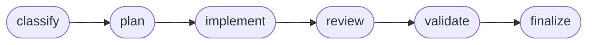

<div align="center">

# 🧵 loom

**Durable, auditable orchestration for LLM agents.**

loom drives multi-step agent work — code review, implementation, any review-gated task —
as a replay-deterministic state machine: human gates where they matter, safety invariants
enforced at commit time, and a complete, replayable audit trail.

[](https://www.npmjs.com/package/@loomfsm/pipeline)
[](LICENSE)
[](.nvmrc)
[](#)

[Quickstart](#quickstart) · [Running loom](#running-loom) · [Configure once](#configure-once) · [Why loom](#why-loom) · [Architecture](ARCHITECTURE.md) · [Whitepaper](WHITEPAPER.md)

</div>

---

## What is loom

You hand loom a task. It drives a sequence of LLM agents through phases —
**classify → plan → implement → review → validate → finalize** — committing every step
atomically to a local SQLite database. You approve at the gates that matter; everything else
runs on its own. The whole run is recorded and replayable, and invariants make certain
failures *structurally impossible*: an agent can't sign off while a blocking issue is open,
or rewrite the tests it's judged by and self-approve.



It's for **high-stakes, multi-step, review-gated work where being wrong is expensive** — not
throwaway prompts. Think *"Temporal for LLM agents"*, with human-in-the-loop, structured
review, and provable safety as first-class primitives.

It runs **five ways**, all driving the *identical* state machine, gates, and invariants:

| | mode | when to use |
|---|---|---|
| 🖥️ | **Web dashboard** — `loom up` | a browser console for the whole fleet — submit, watch, approve, configure |
| 📱 | **Telegram bot** — `loom bot telegram` | drive the fleet from your phone — submit, approve gates, ship — over a chat |
| 💬 | **Inside your agent host** — `/task …` | zero setup; runs through Claude Code, no API key |
| ⚡ | **Headless one-shot** — `loom run "…"` | drive one task to the end from a terminal |
| 🤖 | **Autonomous daemon** — `loom daemon` | set-and-forget; parks on your gates, wakes when you answer |

## Quickstart

```bash
npm i -g @loomfsm/pipeline      # installs the `loom` CLI and everything it needs
```

**Web dashboard** — the fastest path:

```bash
loom up      # start the local control plane and open the dashboard
```

It opens at `http://127.0.0.1:4317` with a first-run wizard: choose a backend, add a project,
submit your first task.

**Inside your agent host (Claude Code):**

```bash
loom setup            # register the MCP server + the /task, /done, /resume commands
loom allowlist add    # authorize the current project (once per project; default-deny)
```

then, in that project: `/task add rate limiting to the login endpoint`.

State lives at `<project>/.loom/state.db` — a plain SQLite file you own. `loom setup` is
idempotent and never overwrites a command you've edited.

## Running loom

Every mode drives the same engine; they differ only in *who executes each step* and *how long
it waits for you*.

### Web dashboard — `loom up`

One local server supervises a fleet of projects and serves a web UI. `loom up` starts it and
opens the page (a bare `loom` does the same).

```bash
loom up                                    # start + open the browser
loom up --no-open                          # start without a browser (SSH / headless)
loom up --port 8080
loom up --token "$(openssl rand -hex 16)"  # require a bearer token on the API
```

From the dashboard you can:

- **browse projects** and their live status — running, parked at a gate, or stalled — with total elapsed time;
- **add a project** by browsing to its folder in an in-app picker (works for a brand-new empty directory), or by path; it's named by its folder, not its full path;
- **submit a task**, choose its policy, **flag it ⚡ fast** for a single-pass run (or pick a complexity), optionally **run it in Docker** (see [Container isolation](#container-isolation)), and pre-arm **push / squash-merge on accept**;
- **pause / resume / cancel** — pause stops spending but keeps progress; resume re-drives from where it left off; cancel frees the slot — then **push or squash-merge** a finished task on demand;
- **answer a gate** (accept / reject / auto-apply) — reading the exact spawn output you're approving — and **tail a collapsible live log** over SSE, with tokens / turns / cache as the cost signal;
- **inspect the agent chain** — a horizontal timeline of runs, each with its model, tokens, and duration; click one to read its **prompt + output** and the findings / verdicts it produced — for the live task and for any **finished task** in history;
- **configure once** — tabbed settings for global config, secrets (write-only, masked), the per-agent model map, and **provider keys managed per backend**, through forms generated from the config schema.

The server binds loopback by default. Pass `--token` (or set `LOOM_SERVER_TOKEN`) to require
`Authorization: Bearer …` on every API call. This is a localhost operator console, not a
multi-tenant service.

`loom serve` is the same control plane without a browser — for a remote box or an always-on
supervisor (`loom serve --project ./svc --token "$TOKEN"`; `loom serve status | stop`).

### Telegram bot — `loom bot telegram`

Drive the fleet from your phone. The bot is a thin client of the control plane
(`loom up` / `loom serve`): pick a project, submit a task, **approve or answer gates with
inline buttons**, read the plan and live status on a tap, and **push / squash-merge** a
finished task — all from a chat.

```bash
export LOOM_TG_BOT_TOKEN="<token from @BotFather>"
export LOOM_TG_ALLOWED_USERS="<your Telegram user id>"   # comma-separated; default-deny
loom bot telegram                                         # needs a control plane running (loom up / loom serve)
```

It is **outbound-only** (long-poll, no webhook), so the control plane stays loopback-bound —
there is no inbound port to open. The one auth surface is the user-id allowlist: the bot can
launch agents on your repos, so an un-listed sender is refused (message the bot once and it
replies with your id). Point it at a remote plane with `LOOM_SERVER_URL` / `LOOM_SERVER_TOKEN`.

### Inside your agent host — `/task`

Zero setup: your host (Claude Code) executes each agent step, and loom surfaces each gate
inline. No API key, no network.

```
/task add rate limiting to the login endpoint   # start
/resume                                          # re-attach to an interrupted task
/done                                            # show the result + clear the slot
```

### Headless one-shot — `loom run`

```bash
loom run "add rate limiting to the login endpoint"
```

Each step runs through the Claude Code CLI (`claude -p`) in an **isolated git worktree**, on
your existing login — your subscription, **no API key**. A genuine human gate pauses and is
printed for you to answer; otherwise it runs straight to a verdict. Your main working tree is
never touched.

### Autonomous daemon — `loom daemon`

A long-lived supervisor over the headless loop — "set it and check back".

```bash
loom daemon start "migrate the auth module to the new SDK"
loom daemon status     # driving / parked at a gate / backing off?
loom daemon stop
```

It runs the work server-side and surfaces you **only at decision points**: it **parks** on a
human gate and **wakes** when you answer, **retries** transient failures with backoff,
**recovers** an interrupted task on restart (idempotent re-delivery, no double work), and
**commits** finished work to a `loom/<task>` branch — reviewable, never auto-merged. `--watch`
keeps the slot for the next task; `--detach` runs it in the background.

### Container isolation

The git-worktree default isolates the *file tree* but not the *process*. For unattended
autonomy, run each spawn inside a container that mounts **only** a dedicated clone of the
project (never your live checkout) plus the one credential needed to sign in — a real
blast-radius bound.

```bash
# 1. Build the reference image (Claude Code CLI + git). Needs loom's docker/ dir — clone the
#    repo, or bring your own image that has `claude` + `git` on PATH.
docker build -t loom-claude:latest docker/

# 2. Point loom at the image + mint a SUBSCRIPTION token (not an API key).
export LOOM_DOCKER_IMAGE=loom-claude:latest
export CLAUDE_CODE_OAUTH_TOKEN="$(claude setup-token)"

# 3. Use it — in the SAME shell (the capability is read once at startup):
loom run --docker "refactor the payment module"   #   CLI: require the fence (no fence, no run)
loom daemon start --docker --watch                #   autonomous, fenced
loom up                                           #   dashboard: the per-task "run in Docker" box is now enabled
```

The toggle is `auto` by default (use Docker if available, else fall back to the worktree with
a notice); `--docker` requires it; `--no-docker` forces the worktree. loom claims only the
isolation it actually provides. Full setup, environment variables, and how the work comes
back: [`docker/`](docker/).

### CLI reference

```
# run
loom up [--no-open] [--port p] [--token t] [--project dir]...   start the control plane + open the dashboard
loom serve [--project dir]... [--host h] [--port p] [--token t] [--detach] [--docker|--no-docker]
loom serve stop | status
loom run "<task>" [--docker|--no-docker]                        drive one task to the end (headless)
loom daemon start [--watch] [--detach] [--docker] ["<task>"]    supervise a project: park/wake, retry, recover
loom daemon stop | status [path]
loom bot telegram                                               drive the fleet from a Telegram chat (needs a running plane)

# configure once (global; every project inherits it)
loom config get [key] | set <key> <value>                       backend mode + notify / resilience defaults
loom secrets set <name> <value> | list                          machine-local secret store (chmod 600); masked on list
loom models set <agent> <provider:model|tier> | list            bind a bundle's agents to models
loom projects add [path] [--label <l>] | list | remove <id>     the catalog of projects you've worked on

# host setup & project lifecycle
loom setup [--user|--project] [--dry-run] [--force]             register the MCP server + /task,/done,/resume
loom allowlist add [path] [--dry-run] | list                    authorize a project directory (default-deny)
loom init [--dry-run]                                           ensure .loom/ + authorize this project
loom status  [path]                                             read-only snapshot of the task (flags a stall)
loom reset   [path] [--force] [--dry-run]                       archive a finished task, free the slot
loom history [path]                                             list this project's archived tasks
loom --help | --version
```

## Configure once

loom resolves a backend **per spawn**. Set your keys and a per-agent model map *once* — from
the CLI or the dashboard — and every project inherits it.

```bash
loom config set backend auto                                     # Claude Code CLI if present, else a provider
loom secrets set OPENROUTER_API_KEY sk-...                       # chmod 600, referenced as secret:<name>, never printed
loom models set implementer openrouter:deepseek/deepseek-chat    # bind an agent to a model
loom models list                                                 # each agent's effective model
```

- **`auto`** prefers the Claude Code CLI (your subscription, no key) and falls back to a
  configured provider — **OpenRouter**, **Ollama** (local), or **Anthropic**.
- Each agent can declare a **fallback chain** — try your subscription first, fall back to a
  provider on a rate limit or a hard failure — so a long run doesn't stall on one backend.
- Decision agents (classify, review) run as a single model call; a **file-editing** agent runs
  through an agentic-CLI harness — **Aider** or **opencode** — behind the same isolated-worktree
  seam as `claude -p`, so an implementer can run on DeepSeek or a local Ollama model and actually
  edit files. The harness is chosen by a generic, bundle-declared capability, never by name.
- The dashboard edits this same layer through schema-generated forms — nothing is UI-only.

> Multi-backend dispatch is validated against real non-Claude models, with hardening
> continuing. The zero-config default runs through your Claude Code login.

## Why loom

**🔁 Replay-deterministic and fully auditable.** State lives in atomic SQLite transactions
with one timestamp token threaded through every step, so a run is reproducible bit-for-bit.
Every spawn, finding, verdict, and gate is recorded — open the database and see exactly what
happened, or replay a recorded run against a *changed* invariant to ask "what if".

**🛡️ Safety enforced at commit time, not promised by a prompt.** Invariants run inside the
transaction and roll it back on violation. The `code` bundle ships rules like *"acceptance
can't pass while a blocking finding is open"* and *"if an agent touched the tests, the final
gate must be human-approved"* — so an agent can't quietly rewrite the tests it's judged by and
approve itself.

**🎚️ Human-in-the-loop, on a dial.** A policy decides each gate: `human` (approve every step),
`on-blockers` (ask only on a real blocker — the default), or `auto` (full autonomy with a
deterministic safety floor).

**🔌 Pluggable by design.** Three orthogonal axes — **bundles** (the domain), **providers**
(the LLM backend), **transports** (the wire). Any combination is valid at the kernel boundary;
a new domain is a new bundle and the kernel never changes. The kernel contains no vendor,
model, or transport names (enforced by CI).

**💥 Crash-safe.** Same `(state, timestamp, ledger)` → same trajectory. Recovery is "restart
and let the idempotency ledger dedup" — no half-applied steps. A drop just pauses the daemon,
and it resumes on its own.

> **What it guarantees — honestly.** loom guarantees the *process*: the declared review ran,
> nothing was bypassed, irreversible steps got a human. It does **not** guarantee the model's
> *output* is correct — that's the agents' job. What you get is the ability to *prove* which
> process ran and *see* every decision behind a result.

## Architecture

The kernel is generic — it knows nothing about code review or any domain. Three orthogonal axes
plug into it (**bundles** = the domain, **providers** = the LLM backend, **transports** = the
wire), and any combination is valid. A shared `@loomfsm/driver` runtime holds the transport-neutral
`drive()` loop every transport wraps, so the directive contract is implemented once and the kernel
never changes for a new domain.

**📐 Full architecture, with diagrams — [ARCHITECTURE.md](ARCHITECTURE.md).** Design rationale —
[WHITEPAPER.md](WHITEPAPER.md).

## Packages

Install **`@loomfsm/pipeline`** — the meta-package that pulls the runtime (kernel, loader, driver,
daemon, server, dashboard, mcp-server, cli, the `code` bundle, and the zero-config provider).
The `anthropic-sdk` / `openrouter` / `ollama` providers install on demand, so the base stays
lean.

```
packages/
  kernel/      generic FSM, invariants, ledger, gate-policy, types — no vendor names
  config/      configure-once control layer — keys, per-agent model map, project catalog
  loader/      build-time assembly of the bundle / provider / extension registry
  driver/      orchestration runtime — drive() loop, Executor seam, backend executors
  daemon/      long-lived supervisor over drive() — park/wake, retry, recovery, merge-back
  server/      HTTP control plane — submit / read-model / answer / SSE, multi-project; Telegram bot intake
  dashboard/   React web control plane (SPA), served as prebuilt static assets by the server
  mcp-server/  MCP transport (stdio); the /task, /done, /resume commands
  cli/         the `loom` binary
  pipeline/    @loomfsm/pipeline — the one-step meta-package
  providers/   claude-code-shuttle (default) · anthropic-sdk · openrouter · ollama
  bundles/     code — the code-review / implementation bundle
```

## What it isn't

- Not a prompt-template framework — templates live in bundles, typed and validated.
- Not an agent IDE — it runs underneath your IDE / shell / MCP host.
- Not a distributed runtime — single in-flight task per project, by design.
- Not "AGI plumbing" — a finite-state machine that survives crashes and tells you what happened.

## Status

**`v0.3.x` (current)** — configure once, any model, drive it from a browser or your phone, and
run without Claude:

- **0.3.0** — the configure-once control layer (`loom config / secrets / models`), per-spawn
  multi-backend resolution (`auto`, else OpenRouter / Ollama / Anthropic), non-Claude
  file-editing harnesses (Aider / opencode), and the **web dashboard** with `loom up`.
- **0.3.1** — operator UX: a fast-task path, per-task Docker, live model dropdowns,
  pause / resume / cancel, total elapsed, and a human-readable log.
- **0.3.2** — observability: the per-task **agent-chain view** (model, tokens, derived
  duration, findings / verdicts, the documents each run wrote) and an **archived-task browser**
  that reopens any finished task in the same view.
- **0.3.3** — pipeline hardening: a finished task finalizes and frees its slot cleanly, a
  permanent provider error (a bad model id, a missing credential) parks instead of retry-looping,
  and each task starts from a clean sandbox.
- **0.3.4** — models, observability, and remote control: per-agent **model fallback chains**,
  real cost from every backend, a per-spawn **transcript** you can read at the gate, **push /
  squash-merge** a finished task on demand, the **Telegram remote-control bot**, and a rebuilt
  dashboard (tabbed settings, an in-app folder picker, provider-key management, a horizontal
  agent chain). loom's per-project state moved to `<project>/.loom/` — existing `.claude/` state
  is migrated automatically.

Earlier: the HTTP control plane, container isolation, and unattended hardening in `0.2.1`;
headless `loom run` + the `loom daemon` in `0.2.0`; the interactive kernel + `code` bundle +
MCP/CLI in `0.1.x`. Every layer is additive over the same `drive()` loop, with zero kernel
change.

## Contributing

`pnpm -r typecheck` and `pnpm -r test` must be green before a change is done — the floor.
Licensed under [Apache 2.0](LICENSE).
