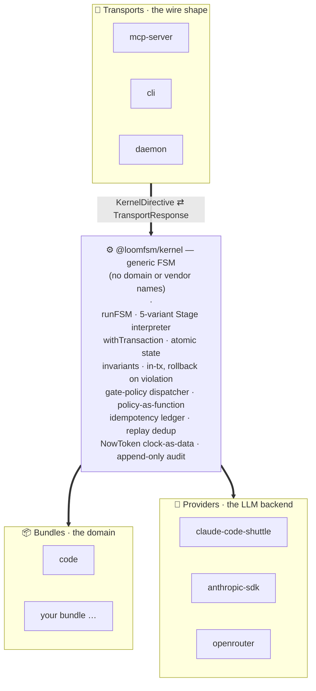
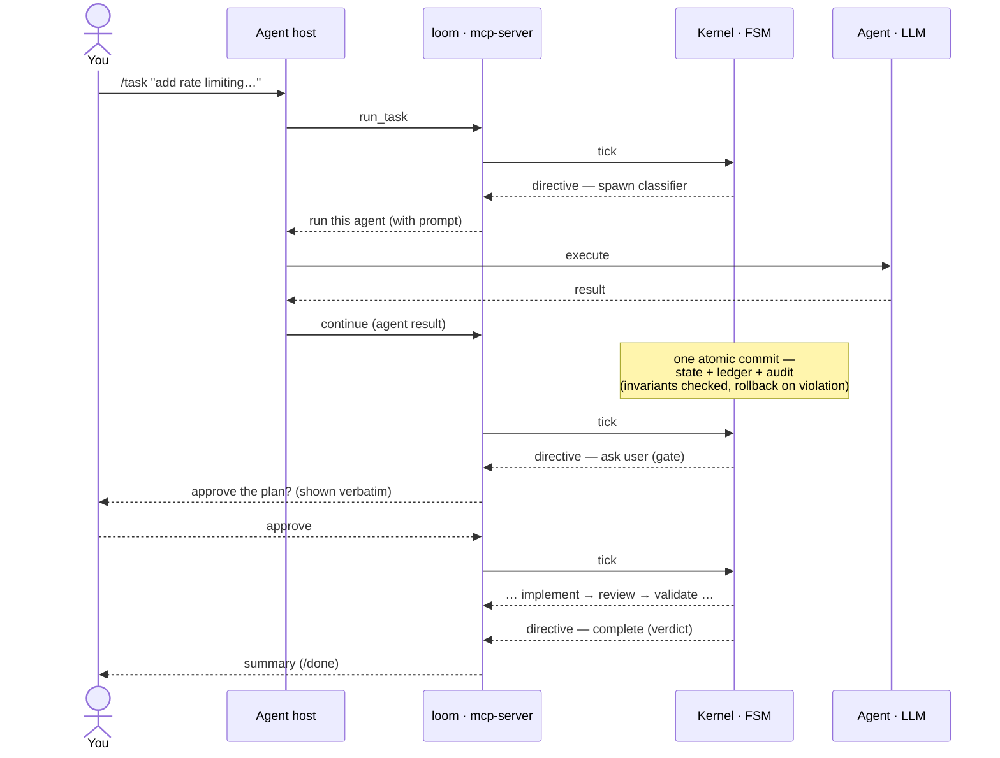
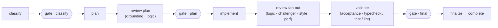
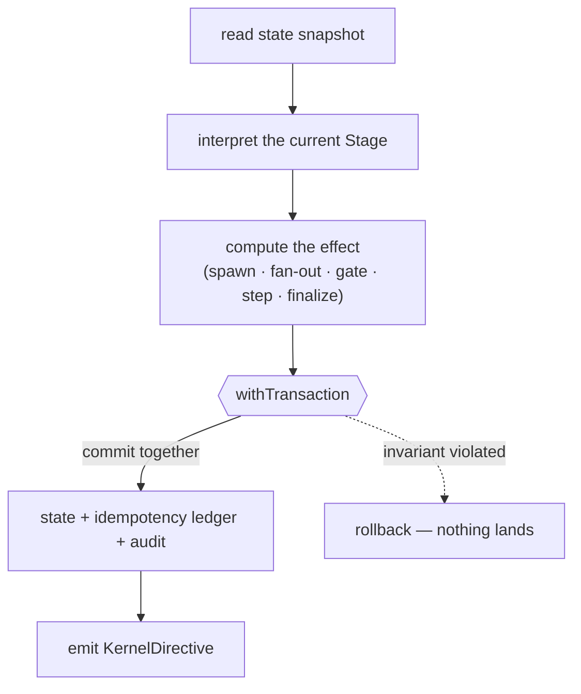

# Loom — Whitepaper

> A substrate for multi-agent LLM workflows. Atomic state. Replay-deterministic FSM. Policy-as-function autonomy. Run it interactively, headless, or as a self-driving daemon.

## Abstract

Most LLM "agent frameworks" are inversion-of-control libraries built around prompt templates and a string-typed event bus. They scale until the first time something needs to be re-run after a crash, or a human needs to look at a multi-step trajectory and ask "why did the model decide that, then." This document describes a different shape: a small, generic FSM kernel that holds the authoritative state of a workflow in atomic transactions, treats LLM providers as a replaceable plugin axis, and decides autonomy via policy functions over state — not via mode flags or "autonomous: true" booleans. Domain knowledge lives in *bundles*, not in the kernel. The kernel does not know what "code review" or "research" is; it knows how to advance, fan out, gate, step, and finalize.

The system is designed for a single in-flight task per project. That constraint is load-bearing: it eliminates a class of concurrency questions that other agent runtimes inherit by accident, and it turns the kernel into something an operator can debug with `sqlite3 state.db`.

The name **Loom** reflects the design. State is the **warp** — structural threads that hold across crashes. Agents are the **weft** — passed through by the FSM, one pick at a time. Providers are the **shuttle** — `claude-code-shuttle` was already in the codebase when the metaphor crystallised; it fits the role too cleanly to call accidental. Each FSM tick is one *pick* of the loom: a complete pass of the shuttle, committed atomically.

## 1. The problem

Three observations motivate the design.

**LLM outputs are non-deterministic; the substrate must be deterministic.** If both the model and the orchestrator are stochastic, you cannot reason about why a workflow ended where it did. The substrate must be the part that holds still.

**Multi-agent workflows accrete state that outlives any single LLM call.** Phases, findings, gate decisions, agent verdicts, idempotency markers — these are first-class data, not stuff to keep in memory. If state lives in the orchestrator's heap, a crash erases the trajectory and the next run does double work or, worse, conflicting work.

**"Autonomous" is a policy, not a mode.** A mode flag like `autonomous: true` is a lie at scale: it forces the kernel to either ask humans about everything or ask humans about nothing. Real autonomy is per-gate, per-role, decided by data the substrate already holds. The decision is a function `(state, role, context) → decision` — and the kernel only knows *when* to ask via policy composition; the *what to auto-decide* belongs to the bundle.

## 2. Thesis — eight principles

The kernel commits to eight constraints, every one of them enforced by code or by a CI grep:

1. **Generic kernel.** No domain vocabulary in `@loomfsm/kernel`. No agent names, no phase names, no review semantics. The kernel runs *some* FSM over *some* bundle; the bundle names the world.
2. **Schemas at every IO boundary.** State, manifests, bundle outputs, MCP tool args — all validated against JSON Schema (Ajv) at every read/write boundary. No "trust the caller."
3. **Invariants over conventions.** Architectural rules are encoded as `Invariant` functions called inside the commit transaction. A violation rolls the transaction back. The 13 kernel invariants split into one schema-meta, nine state-shape, and three ledger-consistency rules.
4. **Code-and-LLM hybrid as methodology, not contract.** Classification = LLM-tool. Deterministic derivation = code. The substrate does not blur the line.
5. **Provider-agnostic.** `LLMProvider` is a plugin. The kernel never imports `@anthropic-ai/sdk` or `openai`; provider lookup is by capability, not by string-name.
6. **Atomic state mutations.** All writes go through `StateBackend.withTransaction`. Either the entire effect of a tick lands in SQLite + the idempotency ledger + the audit log in one commit, or none of it does. State-sync between an in-memory view and the disk view is structurally impossible.
7. **Gates are policy.** The map `gate_policies: Record<GateRole, PolicyName>` *is* the contract. The kernel does not switch on policy names. Adding a new policy is a new factory file + one map entry.
8. **Bundles via manifest.** Bundles declare their capabilities, vocabulary extensions, DDL allowlist, prompt directory, and provider defaults in a manifest. The bundle-loader fails loud at startup, not at first spawn.

The principles are constraints, not aspirations. Each one is paired with a way to falsify it. `grep -rEi "anthropic|openai" packages/kernel/` returns zero matches, or principle 5 is broken.

## 3. Architecture — kernel + three plug axes

The three plug axes — **Bundles**, **Providers**, **Transports** — are orthogonal. Any (transport × provider × bundle) combination is valid at the kernel boundary. Today loom ships one bundle (code review), the zero-config `claude-code-shuttle` provider (with `anthropic-sdk` and `openrouter` in-repo), and three transports — `mcp-server` (stdio), the `cli`, and the local-process **daemon**. Between the transports and the kernel sits one shared runtime, **`@loomfsm/driver`**, which holds the transport-neutral orchestration loop that the headless `loom run` and the daemon both wrap (see *One contract, three ways to run it*, below).

### A run, end to end

The kernel never executes an agent. It emits a **directive** ("spawn this agent", "ask the user this"); the host runs the agent or surfaces the gate and **delivers the result back**, which the kernel commits atomically before emitting the next directive. The loop is the same for one agent or a fan-out of many.

### One contract, three ways to run it

The directive loop above is **transport-neutral**: the kernel emits a `KernelDirective`, something executes it, and the result is delivered back. *What* executes a spawn is a single injected seam — the `Executor` — so the same workflow, the same gates, and the same invariants run in three modes:

- **Interactive (host-relay).** Your agent host (e.g. Claude Code over MCP) executes each spawn and delivers the result; you approve gates inline. This is the sequence above.
- **Headless one-shot (`loom run`).** The `@loomfsm/driver` runtime wraps the same loop in `drive()` and executes each spawn through the Claude Code CLI in print mode (`claude -p`) inside an isolated git worktree — on the operator's existing login, *no API key*. A genuine human gate pauses and is surfaced; nothing else needs a human.
- **Autonomous daemon (`loom daemon`).** A long-lived supervisor over `drive()` that runs the work server-side and surfaces a human *only at decision points*: it **parks** on a gate and **wakes** when it's answered, **retries** transient failures with backoff, **recovers** an interrupted task on restart (the store is the only state — a restart re-attaches and the idempotency ledger dedups, so a slept laptop or killed process just resumes), and **commits** finished work to a `loom/<task>` branch — reviewable, never auto-merged.

None of this is a kernel change. `drive()`, the `Executor`, and the daemon are transport-layer runtime over the same directive contract; the kernel stays generic and side-effect-free. The headless backend runs Claude Code as a *subprocess*, so even there the kernel imports no vendor SDK — principle 5 still holds.

### What the `code` bundle does

The kernel knows nothing about code review — the flow below lives entirely in the `code` bundle as data (agents, a sequence of stages, gate roles, invariants). A different domain is a different bundle over the same kernel.

Each `gate` is resolved by a **policy**, not hard-coded: `human` (ask every time), `on-blockers` (ask only when a blocking finding exists — the default), or `auto` (no human, backed by a deterministic safety floor). The same flow runs hands-on or hands-off depending on the policy map.

## 4. Core primitives

### `Stage` discriminated union

Five variants — `SpawnStage`, `FanoutStage`, `GateStage`, `StepStage`, `FinalizeStage` — over which a ~250 LOC interpreter performs an exhaustive switch. Every flow in every bundle is a sequence of these. There is no sixth kind escape hatch. New behavior is built by composing the five, not by extending the kernel.

### `Policy = (state, role, ctx) → Decision`

The smallest correct shape for an autonomy decision. The kernel hands the policy a bundle-scoped view of state, the gate role, and a context object; the policy returns `human-required`, `auto-approve`, or `auto-reject`. Three factories ship: `human`, `on-blockers`, `auto`. Bundles register additional factories via `Bundle.policy_factories`. The kernel does not switch on policy names; the map IS the contract.

### `StateBackend.withTransaction(now, fn)`

One verb. One law: atomicity. The default backend is SQLite WAL with `BEGIN IMMEDIATE`. Alternative backends (in-memory, libSQL, replicated) implement the same single interface. State mutation outside a transaction is a typing error — `tx` is the only handle that exposes writes.

One tick lands entirely, or not at all:

There is no window in which the state advanced but the ledger didn't, or the audit log recorded an effect the transaction rolled back. That single property is what makes crash recovery "restart and let the ledger dedup" instead of a reconciliation protocol.

### `NowToken`

A branded ISO-8601 string, captured once per tick, persisted in the idempotency ledger and the audit log. Replay reads the persisted token instead of calling `Date.now()`. The kernel's clock is data, not a syscall. Lint enforces: `grep -rE "Date\.now\(\)|new Date\(\)" packages/kernel/src/` returns zero matches. (Caveat: this gives replay *semantic* equivalence, not byte-equality — Ajv error ordering, Map iteration, and `JSON.stringify(Set)` are still hostile to bit-identical comparison.)

### Idempotency ledger

A SQLite table co-committed with every state-changing operation. Each row keys an operation that crossed a system boundary (agent result delivery, user answer, provider call, side-effect hook, MCP tool call). Duplicate delivery returns the persisted response verbatim with `error_class: "duplicate-delivery-replayed"`. Transport-level retries are safe by construction. The ledger is the load-bearing answer to "what happens when the kernel crashes mid-tick" — replay reads the marker and refuses to do work twice.

### Invariants

Pure functions over state, called inside `runInvariants(tx)` at exactly three sites: every commit, every finalize, and every `--validate` run. A violation rolls back the transaction. Invariants declare their `reads` so the runtime can skip them when no relevant state changed. 13 kernel invariants are kernel-generic; bundles contribute their own (`INV_<BUNDLE>_<n>`, starting at 101 to avoid collision).

## 5. What this design gets close to right

**Idempotency discipline.** Every state-changing operation has a structured key. The ledger is co-committed. Crash matrices for the hot delivery path and the shuttle wire-emit are enumerated. A kernel that crashes mid-stage and restarts knows what to do — modulo a handful of edge cases at the MCP-tool-call and schema-migration seams that are documented honestly.

**Acceptance is not a safety boundary.** The substrate refuses to treat LLM-judged "acceptance" as the only line between FSM and "shipped." A bundle that sets any role to `"auto"` must ship deterministic safety-floor invariants (lint-clean, tests-pass, typecheck-clean for the code bundle); bundle-loader refuses otherwise. This is the difference between *honest autonomy* and *theatre*.

**No vendor strings in the kernel.** Provider names, transport names, and model names do not appear in `@loomfsm/kernel`. The CI grep enforces this. Swapping `anthropic-sdk` for `openrouter` is a config edit; swapping the kernel's idea of what a provider *is* — not a change a user can make, and that's the point.

**State is observable.** Operators inspect with `sqlite3 state.db`. The wiki is also the operator's runbook. There is no proprietary state format; there is no telemetry pipeline you need to stand up before you can debug.

## 6. What this design deliberately doesn't ship yet

Scope honesty matters more than feature counting. The following are intentionally out of the current release — additive, planned for later:

- **Networked / multi-tenant transport.** The local-process daemon ships (`loom daemon` — supervise, park/wake, retry, recover, branch merge-back). What's still additive: an HTTP transport (remote control, a web dashboard, task intake from an issue tracker or a chat) and multi-project supervision in one control-plane — the same `drive()` behind an adapter, as stdio sits behind MCP. No kernel change.
- **Multi-bundle / multi-task in one project.** loom runs one bundle and one in-flight task per project, by design — a finished task archives so the next starts clean. Running several *projects* in parallel already works (one daemon per project, isolated stores); several bundles or tasks *in the same project* is the part the substrate doesn't orchestrate yet.
- **Bundle runtime isolation (worker-thread fence).** loom runs bundles in-process under curated trust. Manifest declares capabilities; the bundle-loader checks them at load. The *runtime* fence (separate worker, RPC marshalling of `BundleOp[]`) lands when the third-party marketplace lands. The current threat model has zero third-party bundles.
- **Memory subsystem.** Cross-task and cross-project memory is a deferred plugin. Substrate reserves the capability vocabulary and the `memory_query` MCP tool slot.
- **Observability backends beyond local logs and `/metrics`.** OTel attributes are declared but the production-grade collector wiring is planned.

The substrate is *additive* to all of these. None requires re-shaping the kernel. That property is what most of the architectural rigour is paying for.

## 7. Honest scope and timeline

- **Kernel size**: ~12-15k LOC, before the bundle. The headless `@loomfsm/driver` runtime and the `@loomfsm/daemon` supervisor are separate, lean packages — additive over the kernel, not part of it.
- **Bundle authoring**: a new bundle is a focused, self-contained effort given the substrate — agents, flows, and invariants as data, no kernel changes.
- **Validation**: the `code` bundle has driven real `/task` runs end to end through an MCP host to `complete:accepted`, with the audit log recording every spawn, finding, verdict, and gate. As of `0.2.0` the same flow also runs **headless** (`loom run`) and under the **daemon**, executing each spawn through `claude -p` in an isolated worktree; the deterministic paths are covered by the test suite, with an opt-in real-`claude` end-to-end.

The kernel is not "production-ready" because of architectural elegance; it is production-ready because it is exercised on real work and the audit log lets an operator see what happened. Architectural elegance is the precondition, not the proof.

## 8. License and authorship

Solo-authored. Licensed under Apache 2.0 (see [LICENSE](LICENSE)) — permissive, with an explicit patent grant suited to the AI/LLM space. Contributions welcome via PR with conventional-commit subjects.

---

*Whitepaper version 1.1 · status: `v0.2.0`, published to npm under `@loomfsm/*` (headless run + daemon).*
